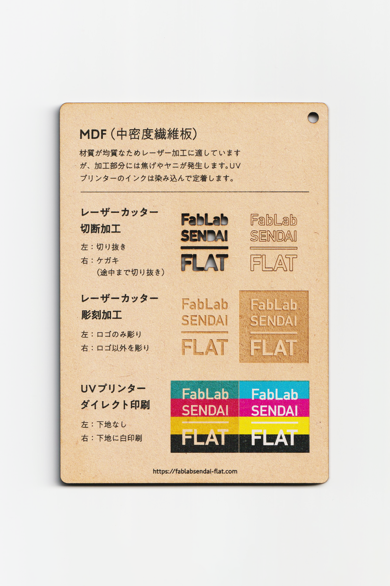

 

## MDF（中密度繊維板）/ Medium-density fibreboard
  

表面がなめらかで材質が均質なため、加工がしやすい木質ボードです。 
材質が均質なためレーザー加工に適していますが、加工部分には焦げやヤニが発生します。 
UVプリンターのインクは染み込んで定着します。 
（用途例：棚などの家具類、スピーカーのキャビネット、小物 等）
 
 

<table>
  <tr style="border:none;">
    <td style="border:none;"></td>
    <td style="border:none;"></td>
  </tr>
</table>

  

### FabLab SENDAI - FLATでの加工事例 / Examples
 

[**レーザーカッター加工事例 / Laser Cutter**](https://www.flickr.com/search/?user_id=96175517%40N02&sort=date-taken-desc&safe_search=1&view_all=1&tags=mdflc)

[**UVプリンター加工事例 / UV Printer**](https://www.flickr.com/search/?user_id=96175517%40N02&sort=date-taken-desc&safe_search=1&view_all=1&tags=mdfuv)

  

### 加工時の注意事項 / Notice
 

**レーザーカッター / Laser Cutter**
 
* 焦げやヤニの付着を防ぐため、表面にマスキングテープを貼って加工すると良い。 

* 加工部分のベタつきは、ウェットティッシュ等で拭き取ると良い。  

**UVプリンター / UV Printer**
 
* インクが染み込みやすいため、厚盛りしたい場合は、先にグロスインク等で下地を印刷しておくと良い。 

  

### サンプル情報 / Sample
 

**素材サイズ / Material Size** 
横 (W)105mm × 縦 (H)148.5mm × 厚さ (D)4mm 

**加工マシン / Machines** 
レーザーカッター / Laser Cutter：trotec speedy 100(60W) 
UVプリンター / UV Printer：Roland LEF-12 

**レーザー加工設定参考値 / Laser Cutter Parameters** 
切り抜き / Cut：POWER 67／SPEED 0.6 
ケガキ（途中まで切り抜き）/ Marking-Off：POWER 12／SPEED 1 
彫刻 / Engrave：POWER 40／SPEED 10／333dpi 

  

（Last Updated: 2022.10.31）

