## レーザーカッター、UVプリンターでの加工例
  

掲載している素材の加工結果はあくまで参考例です。製造メーカーや保管方法、加工状況等により結果が異なる場合がありますのでご注意ください。 
 
尚、本ページに掲載された情報の利用によって生じた損害については、一切の保証・賠償は行いません。ご利用に当たっては、ご自身の責任で行っていただきますようお願いいたします。
 
 
 

<a href="https://fablabsendai.github.io/materials-archive/02-1-mdf.html" title="MDF（中密度繊維板）/ Medium-density fibreboard">
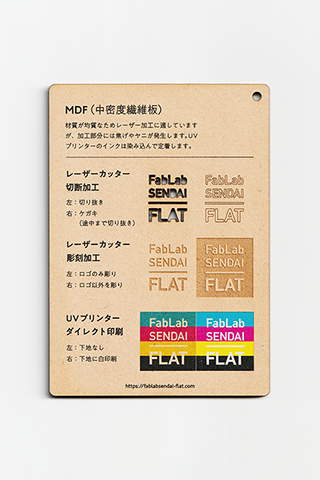
</a>
<a href="https://fablabsendai.github.io/materials-archive/02-2-shina.html" title="シナ合板 / Basswood Plywood">
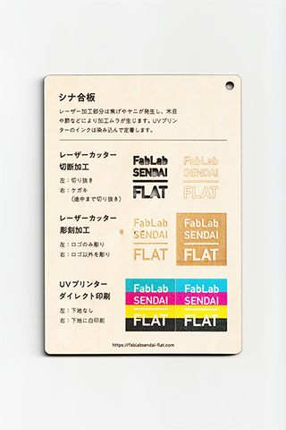
</a>
<a href="https://fablabsendai.github.io/materials-archive/02-3-hinoki.html" title="ひのき / Japanese Cypress">
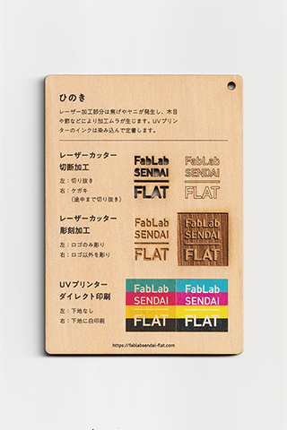
</a>
<a href="https://fablabsendai.github.io/materials-archive/02-4-lauan.html" title="ラワン合板 / Lauan Plywood">
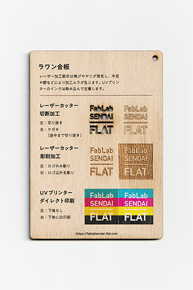
</a>
<a href="https://fablabsendai.github.io/materials-archive/02-5-bamboo.html" title="竹 / Bamboo">
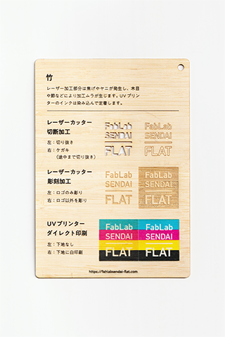
</a>
<a href="https://fablabsendai.github.io/materials-archive/02-6-fukiurushi-mdf.html" title="拭き漆MDF / Fuki-urushi MDF">
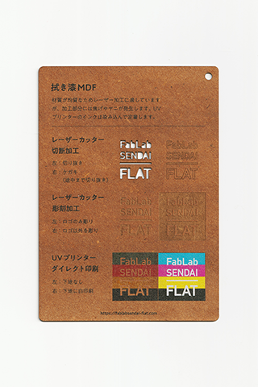
</a>
<a href="https://fablabsendai.github.io/materials-archive/03-1-abs.html" title="ABS樹脂 / ABS">
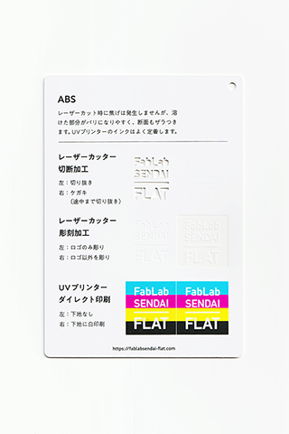
</a>
<a href="https://fablabsendai.github.io/materials-archive/03-2-pet.html" title="PET（ポリエチレンテレフタレート）/ Polyethylene Terephthalate">
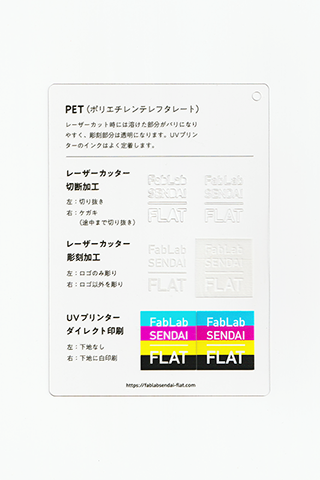
</a>
<a href="https://fablabsendai.github.io/materials-archive/03-3-pla.html" title="PLA（ポリ乳酸）/ Poly-Lactic Acid">
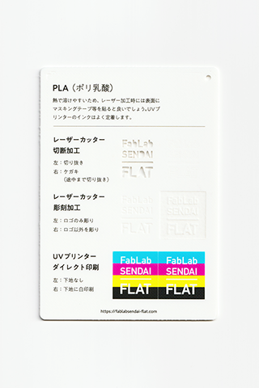
</a>
<a href="https://fablabsendai.github.io/materials-archive/03-4-acryl.html" title="アクリル / Acreyl">
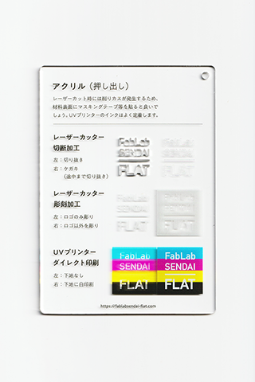
</a>
<a href="https://fablabsendai.github.io/materials-archive/03-5-styrene-b.html" title="スチレンボード / Foam Core Board">
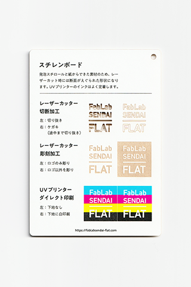
</a>
<a href="https://fablabsendai.github.io/materials-archive/03-6-styrene-p.html" title="スチレンペーパー / Styrene Foam Board">
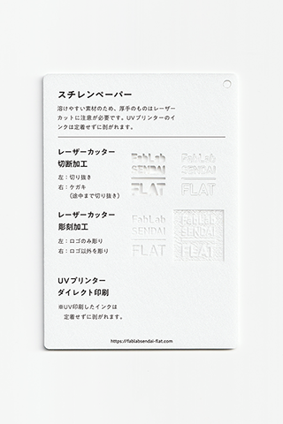
</a>
<a href="https://fablabsendai.github.io/materials-archive/03-7-pp.html" title="PP（ポリプロピレン）シート / Polypropylene Sheet">
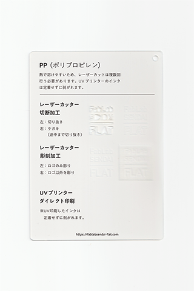
</a>
<a href="https://fablabsendai.github.io/materials-archive/03-8-silicone.html" title="シリコーンゴム / Silicone Rubber">
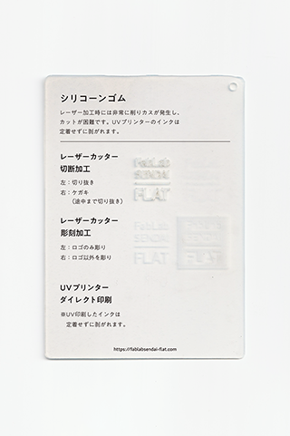
</a>
<a href="https://fablabsendai.github.io/materials-archive/03-9-p-cb.html" title="プラスチック段ボール / Corrugated Plastic(PP)">
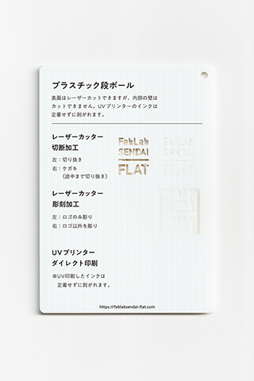
</a>
<a href="https://fablabsendai.github.io/materials-archive/03-10-lighteva.html" title="ライトエヴァ（EVA）シート / Light EVA Sheet">
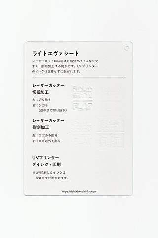
</a>
<a href="https://fablabsendai.github.io/materials-archive/03-11-eva.html" title="EVAフォーム / EVA foam sheet">
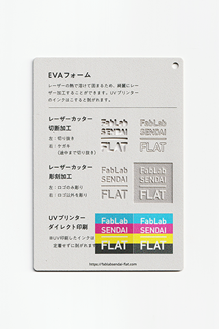
</a>
<a href="https://fablabsendai.github.io/materials-archive/03-12-pvc.html" title="PVC（塩化ビニル樹脂）シート（硬質）/ Hard PVC Sheet">
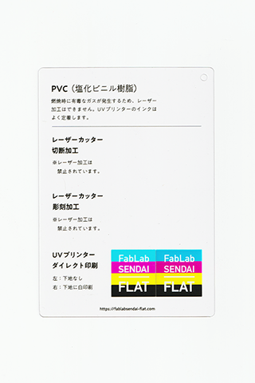
</a>
<a href="https://fablabsendai.github.io/materials-archive/03-13-mirrored-acrylic.html" title="アクリルミラー板 / Mirrored Acrylic">
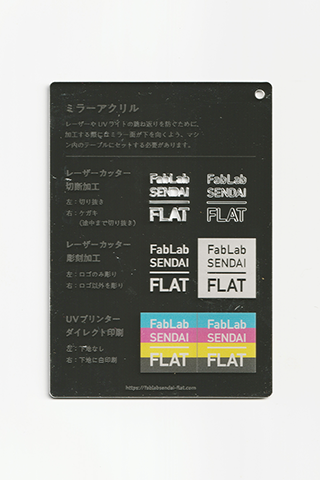
</a>
<a href="https://fablabsendai.github.io/materials-archive/03-14-olefin.html" title="カッティングシート（オレフィン系） / Olefin Sheet">
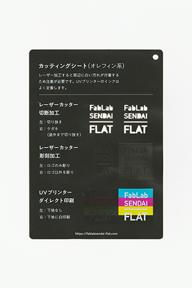
</a>
<a href="https://fablabsendai.github.io/materials-archive/04-1-tracingpaper.html" title="トレーシングペーパー / Tracing Paper">
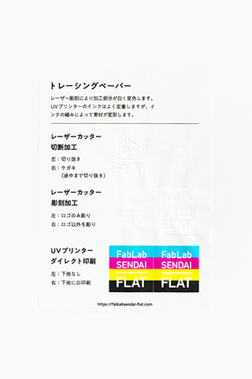
</a>
<a href="https://fablabsendai.github.io/materials-archive/04-2-vf.html" title="バルカナイズドファイバー / Vulcanized Fiber">
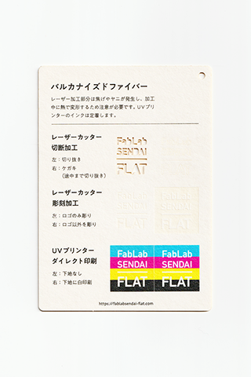
</a>
<a href="https://fablabsendai.github.io/materials-archive/04-3-board-w.html" title="ボール紙(1) / Paper Board (1)">
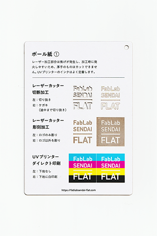
</a>
<a href="https://fablabsendai.github.io/materials-archive/04-4-board-g.html" title="ボール紙(2) / Paper Board (2)">
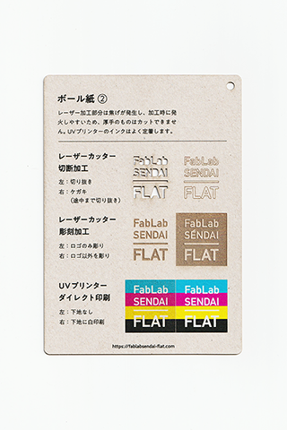
</a>
<a href="https://fablabsendai.github.io/materials-archive/04-5-cb.html" title="段ボール / Cardboard">
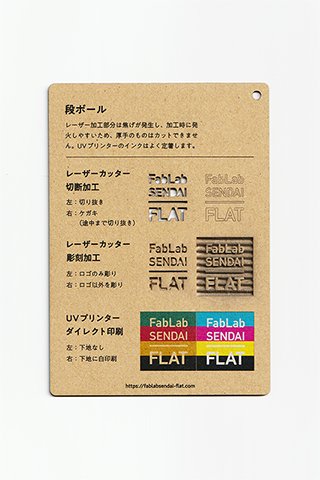
</a>
<a href="https://fablabsendai.github.io/materials-archive/04-6-washi.html" title="和紙（コウゾ）/ Washi (Japanese paper)">
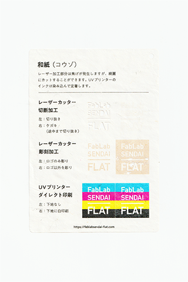
</a>
<a href="https://fablabsendai.github.io/materials-archive/04-7-copy.html" title="コピー用紙 / Copy Paper">
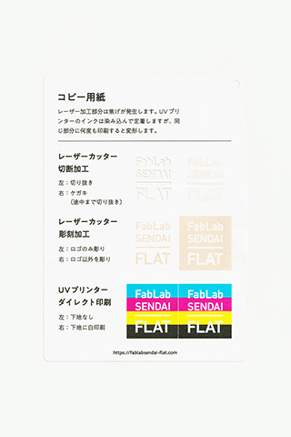
</a>
<a href="https://fablabsendai.github.io/materials-archive/04-8-illustrationboard.html" title="イラストレーションボード / Illustration Board">
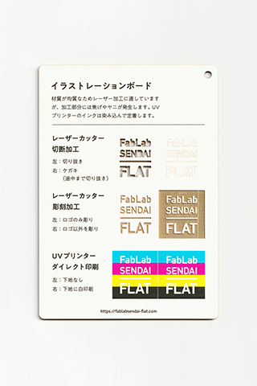
</a>
<a href="https://fablabsendai.github.io/materials-archive/05-1-cork.html" title="コルク / Cork">
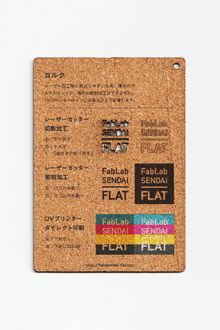
</a>
<a href="https://fablabsendai.github.io/materials-archive/05-2-kanshitsu.html" title="乾漆（漆,米糊,寒冷紗）/ KANSHITSU Sheet">
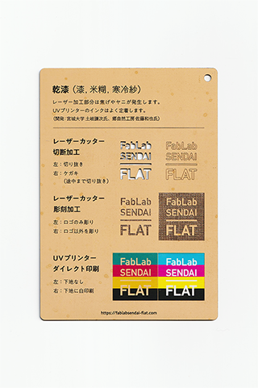
</a>
<a href="https://fablabsendai.github.io/materials-archive/05-3-leather.html" title="牛革（タンニンなめし）/ Cow Leather">
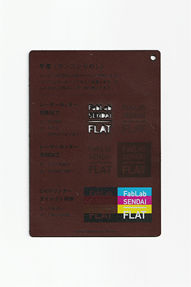
</a>

<a href="https://fablabsendai.github.io/materials-archive/06-2-felt-w.html" title="フェルト（ウール60%, レーヨン40%）/ Felt (60%Wool, 40%Rayon)">
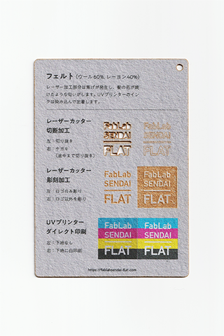
</a>
<a href="https://fablabsendai.github.io/materials-archive/06-3-felt-p.html" title="フェルト（ポリエステル100%）/ Felt (100%Polyester)">
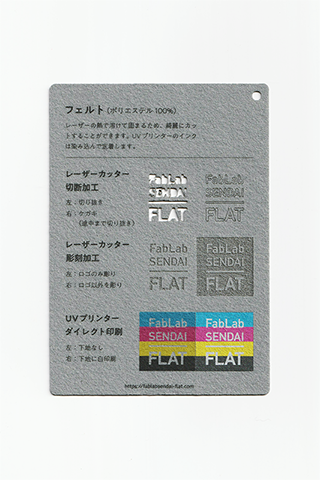
</a>
<a href="https://fablabsendai.github.io/materials-archive/06-4-polyester.html" title="ポリエステル（100%）布 / Polyester Fabric">
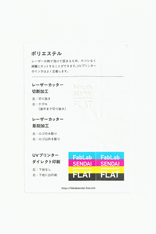
</a>
<a href="https://fablabsendai.github.io/materials-archive/06-5-cotton.html" title="綿（100%）布 / Cotton">
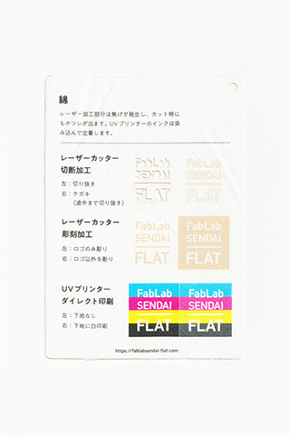
</a>

<a href="https://fablabsendai.github.io/materials-archive/06-7-pp.html" title="不織布（PP）/ Non-woven Fabric">
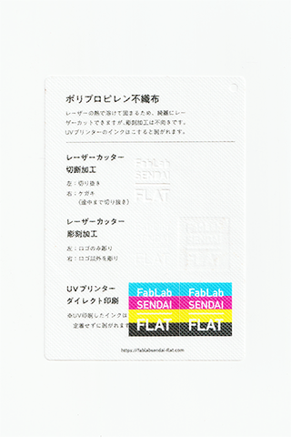
</a>
<a href="https://fablabsendai.github.io/materials-archive/06-8-knitcloth.html" title="マジッククロス（ポリエステル） / Magic Cloth">
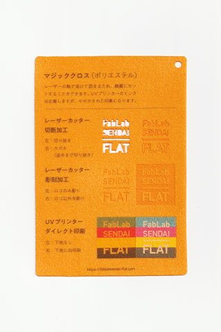
</a>

 

  

（Last Updated: 2022.10.31）

