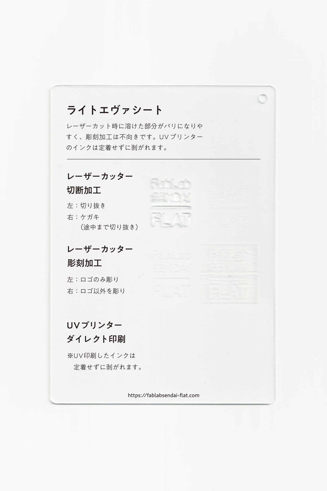

### ライトエヴァ（EVA）シート
 

柔らかく弾力のある樹脂素材です。（規格・生産：ライト化成工業株式会社） 
レーザーカット時には溶けた部分がバリになりやすく、彫刻加工は不向きです。 
UVプリンターのインクは定着せずに剥がれます。 
（用途例：DIY用材料、車の泥除け 等）

 

 

  

#### 加工時の注意事項

**レーザーカッター**
 
* バリの発生や削りカスの付着を防ぐため、表面にマスキングテープを貼って加工すると良い。
* 溶けやすいため、レーザーカット時は低い温度でゆっくり2回加工すると良い。

**UVプリンター**
 
* UV印刷したインクは定着せずに剥がれます。

  

#### サンプル情報

* **素材サイズ** 
横105mm × 縦148.5mm × 厚さ1mm

* **加工マシン** 
レーザーカッター：trotec speedy 100(60W) 
UVプリンター：Roland LEF-12 

* **レーザー加工設定参考値** （表面にマスキングテープを貼って加工） 
切り抜き：POWER 30／SPEED 0.8 ×2回 
ケガキ（途中まで切り抜き）：POWER 8／SPEED 1 
彫刻：POWER 22／SPEED 5／333dpi 

  

（作成日・改訂日 2022.10.31作成）
