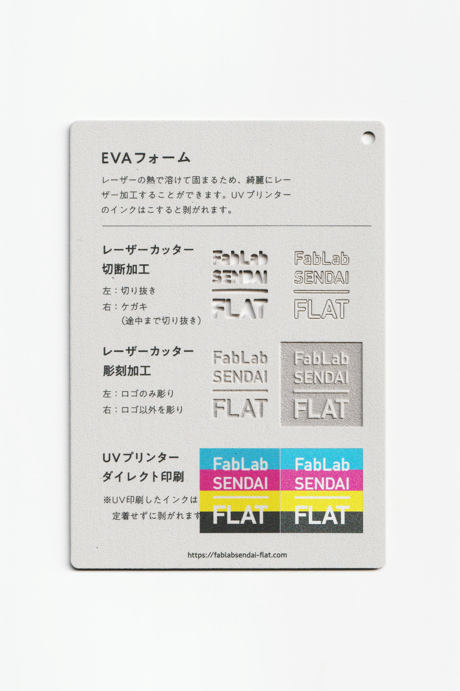

 

### EVAフォーム / EVA foam sheet

  

軽くて柔軟性が高く、弾力のある発泡樹脂素材（スポンジ状素材）です。 
レーザーの熱で溶けて固まるため、綺麗にレーザー加工することができます。 
UVプリンターのインクはこすると剥がれます。 
（用途例：フロアマット、ビーチサンダル、ビート板 等）
 
 

<table>
<tr style="border:none;">
<td style="border:none;"></td>
<td style="border:none;"></td>
</tr>
</table>

  

#### 加工時の注意事項 / Notice

**レーザーカッター / Laser Cutter**
 
* 厚さ1mm等薄いボードを加工する場合は、素材のズレを防ぐため、カット時はエアーをオフにすると良い。  

**UVプリンター / UV Printer**
 
* UV印刷したインクはこすると剥がれます。 

  

#### サンプル情報 / Sample

**素材サイズ / Material Size** 
横 (W)105mm × 縦 (H)148.5mm × 厚さ (D)2mm 

**加工マシン / Machines** 
レーザーカッター / Laser Cutter：trotec speedy 100(60W) 
UVプリンター / UV Printer：Roland LEF-12 

**レーザー加工設定参考値 / Laser Cutter Parameters** 
切り抜き / Cut：POWER 15／SPEED 1 
ケガキ（途中まで切り抜き）/ Marking-Off：POWER 6／SPEED 1 
彫刻 / Engrave：POWER 18／SPEED 5／333dpi 

  

（Last Updated: 2022.10.31）

