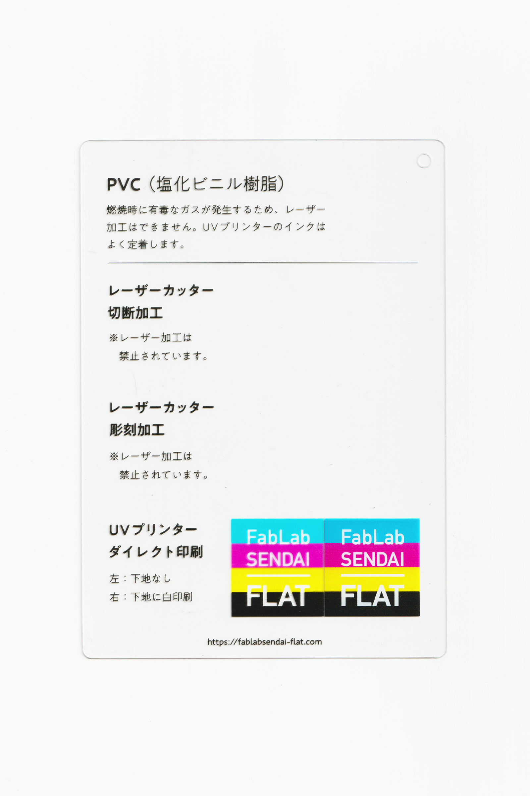

 

## PVC（塩化ビニル樹脂）シート（硬質） / Hard PVC Sheet
  

耐候性に優れ、熱による曲げ等の加工のしやすい樹脂です。 
有毒なガスが発生するため、レーザー加工はできません。 
カットにはカッティングプロッタを使用します。 
UVプリンターのインクはよく定着します。 
（用途例：看板、ダクト、水道管、床材 等）
 
 

 

### **加工時の注意事項 / Notice**
 

**レーザーカッター / Laser Cutter**

※加工時に有毒なガスが発生するため、レーザー加工は禁止。 

**UVプリンター / UV Printer**
* 加工面に油分やゴミが付着しないよう、加工直前にアルコール等で拭くと良い。 

 

### **サンプル情報 / Sample**
 

**素材サイズ / Material Size** 
横105mm × 縦148.5mm × 厚さ0.5mm 

**加工マシン / Machines** 
UVプリンター：Roland LEF-12 

  

（Last Updated: 2022.10.31）

