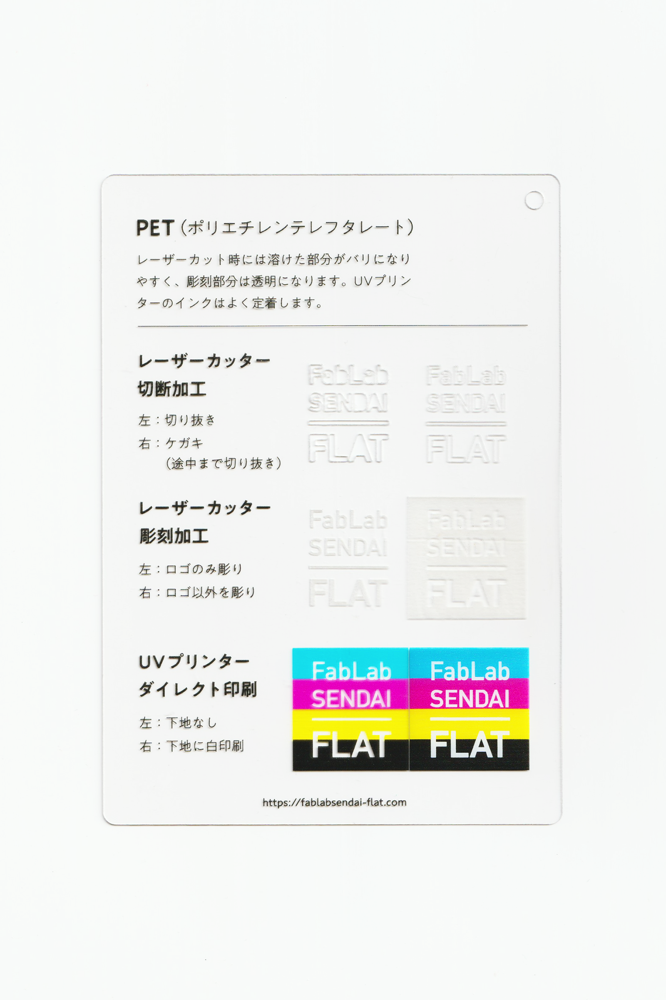

 

## PET（ポリエチレンテレフタレート）/ Polyethylene Terephthalate
  

透明度が高く、燃やしても有毒ガスを発生しない、環境に優しい樹脂です。 
レーザーカット時には溶けた部分がバリになりやすく、彫刻部分は透明になります。 
UVプリンターのインクはよく定着します。 
（用途例：食品用容器、衣料用繊維 等）
 
 

<table>
<tr style="border:none;">
<td style="border:none;"></td>
<td style="border:none;"></td>
</tr>
</table>

  

### 加工時の注意事項 / Notice
 

**レーザーカッター / Laser Cutter**
 
* バリの発生や削りカスの付着を防ぐため、表面にマスキングテープを貼って加工すると良い。  

**UVプリンター / UV Printer**
 
* 加工面に油分やゴミが付着しないよう、加工直前にアルコール等で拭くと良い。 

  

### サンプル情報 / Sample
 

**素材サイズ / Material Size** 
横 (W)105mm × 縦 (H)148.5mm × 厚さ (D)0.5mm 

**加工マシン / Machines** 
レーザーカッター / Laser Cutter：trotec speedy 100(60W) 
UVプリンター / UV Printer：Roland LEF-12 

**レーザー加工設定参考値 / Laser Cutter Parameters** 
（表面にマスキングテープを貼って加工） 
切り抜き / Cut：POWER 23／SPEED 1 
ケガキ（途中まで切り抜き）/ Marking-Off：POWER 12／SPEED 1 
彫刻 / Engrave：POWER 30／SPEED 10／333dpi 

  

（Last Updated: 2022.10.31）

