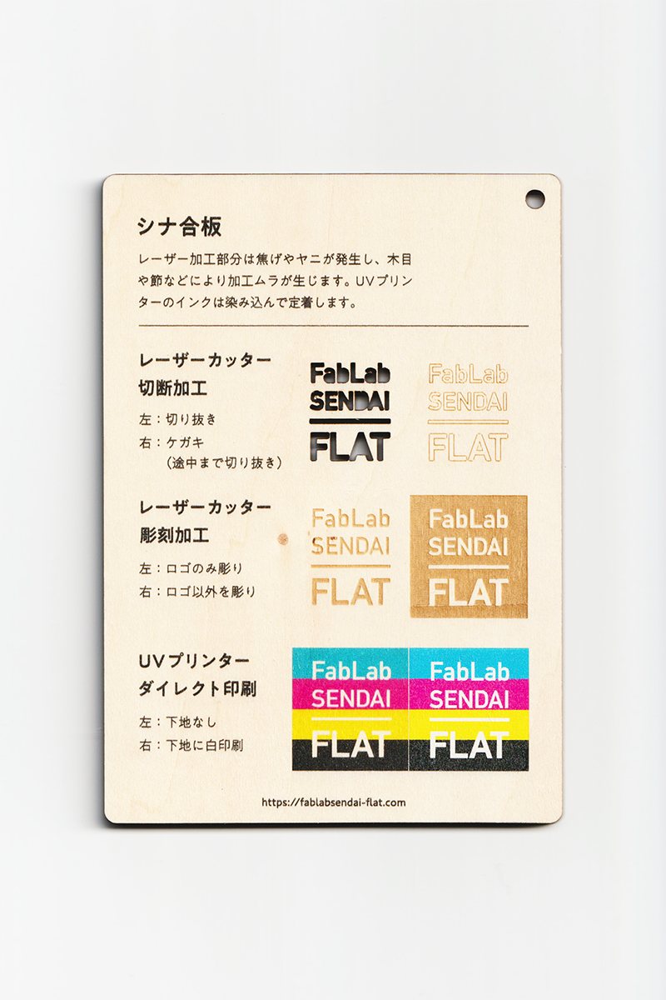
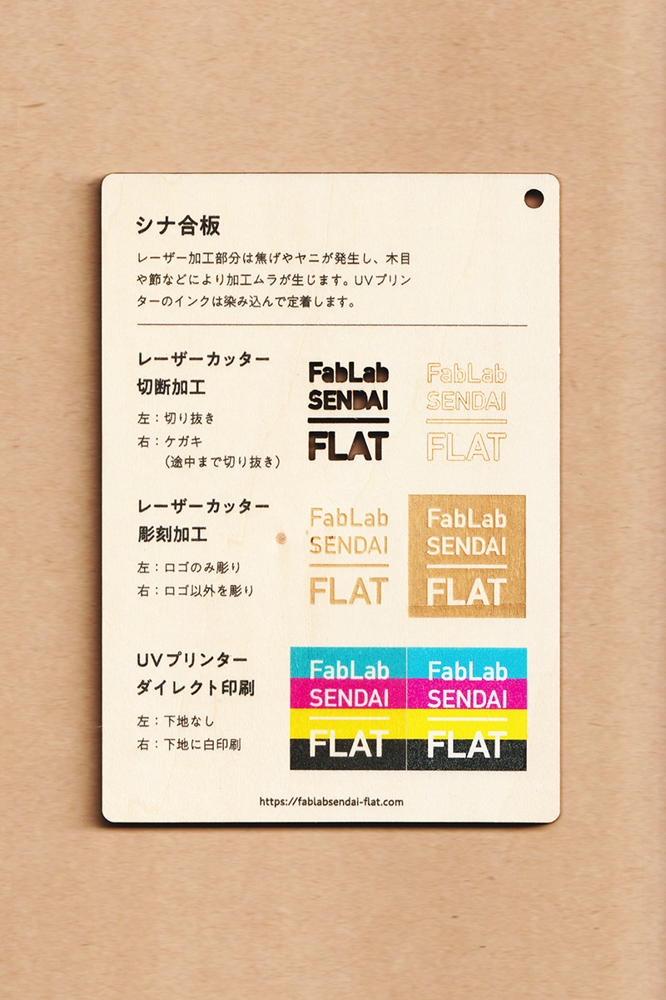

 

## シナ合板 / Basswood Plywood
  

表面がなめらかで、塗装や切断などの加工がしやすい木材です。 
レーザー加工部分は焦げやヤニが発生し、木目や節などにより加工ムラが生じます。 
UVプリンターのインクは染み込んで定着します。 
（用途例：家具、建築材、DIY用材料 等）
 
 

 

### **FabLab SENDAI - FLATでの加工事例（木材全般） / Examples**

* [**レーザーカッター加工事例 / Laser Cutter**](https://www.flickr.com/search/?user_id=96175517%40N02&sort=date-taken-desc&safe_search=1&view_all=1&tags=woodlc)
* [**UVプリンター加工事例 / UV Printer**](https://www.flickr.com/search/?user_id=96175517%40N02&sort=date-taken-desc&safe_search=1&view_all=1&tags=wooduv)

 

### **加工時の注意事項 / Notice**

**レーザーカッター / Laser Cutter**
* 焦げやヤニの付着を防ぐため、表面にマスキングテープを貼って加工すると良い。 
* 加工中に熱で変形するため、ブリッジを付けたり、土台に両面テープ等で固定すると良い。 
* 加工部分のベタつきは、ウェットティッシュ等で拭き取ると良い。 

**UVプリンター / UV Printer**
* インクが染み込みやすいため、厚盛りしたい場合は、先にグロスインク等で下地を印刷しておくと良い。 

 

### **サンプル情報 / Sample**

**素材サイズ / Material Size** 
横 (W)105mm × 縦 (H)148.5mm × 厚さ (D)4.3mm 

**加工マシン / Machines** 
レーザーカッター / Laser Cutter：trotec speedy 100(60W) 
UVプリンター / UV Printer：Roland LEF-12 

**レーザー加工設定参考値** 
切り抜き / Cut：POWER 50／SPEED 0.8 
ケガキ（途中まで切り抜き）/ Marking-Off：POWER 8／SPEED 1 
彫刻 / Engrave：POWER 40／SPEED 10／333dpi 

  

（Last Updated: 2022.10.31）

