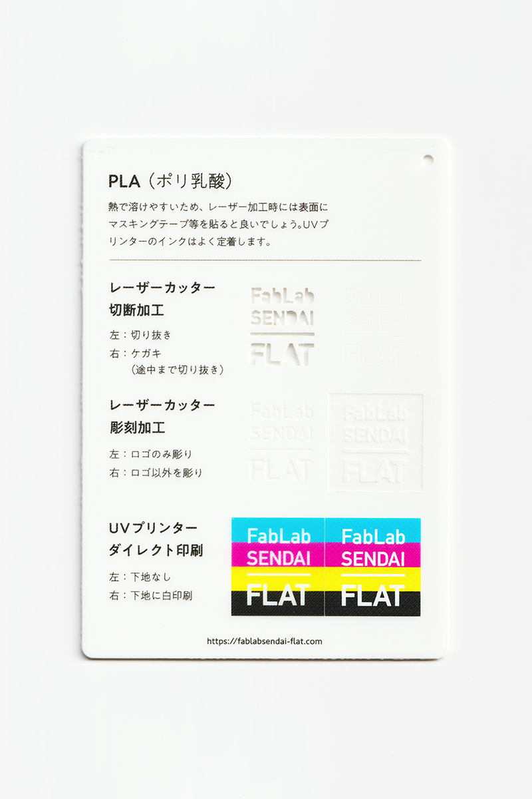
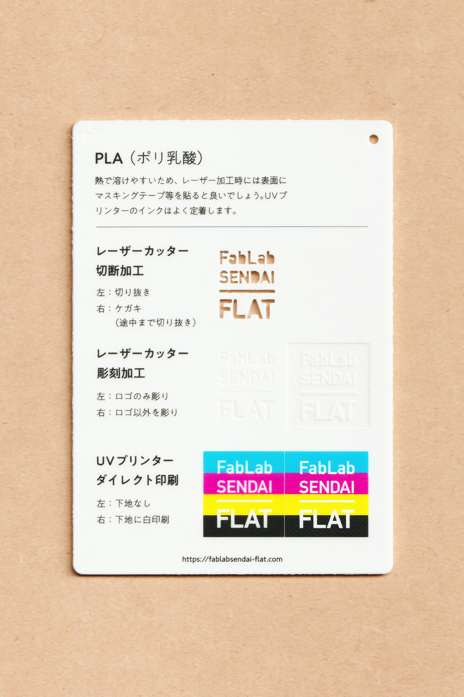

### PLA（ポリ乳酸）
 

とうもろこし等のデンプンから作られた、植物由来のバイオプラスチックです。 
熱で溶けやすいため、レーザー加工時には表面にマスキングテープ等を貼ると良いでしょう。 
UVプリンターのインクはよく定着します。 
（用途例：食品用トレイ、3Dプリンターー用材料 等）

 

 

  

##### 加工時の注意事項

**レーザーカッター**
 
* バリの発生や削りカスの付着を防ぐため、表面にマスキングテープを貼って加工すると良い。
* 溶けやすいため、レーザーカット時は低い温度でゆっくり2回加工すると良い。

**UVプリンター**
 
* 加工面に油分やゴミが付着しないよう、加工直前にアルコール等で拭くと良い。

  

##### サンプル情報

* **素材サイズ** 
横105mm × 縦148.5mm × 厚さ2mm

* **加工マシン** 
レーザーカッター：trotec speedy 100(60W) 
UVプリンター：Roland LEF-12 

* **レーザー加工設定参考値** （表面にマスキングテープを貼って加工） 
切り抜き：POWER 35／SPEED 0.8 ×2回 
ケガキ（途中まで切り抜き）：POWER 15／SPEED 1 
彫刻：POWER 40／SPEED 5／333dpi 

  

（作成日・改訂日 2022.10.31作成）
