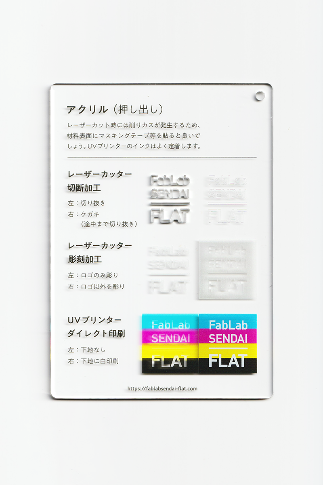

### アクリル
 

切断や曲げなどの加工がしやすく、様々な工業製品に用いられている樹脂です。 
レーザーカット時には削りカスが発生するため、材料表面にマスキングテープ等を貼ると良いでしょう。 
UVプリンターのインクはよく定着します。 
（用途例：窓材、水槽、生活用品、キーホルダー 等）

 

 

  

#### FabLab SENDAI - FLATでの加工事例

[**レーザーカッター加工事例**](https://www.flickr.com/search/?user_id=96175517%40N02&sort=date-taken-desc&safe_search=1&view_all=1&tags=acryllc)

[**UVプリンター加工事例**](https://www.flickr.com/search/?user_id=96175517%40N02&sort=date-taken-desc&safe_search=1&view_all=1&tags=acryluv)

  

#### 加工時の注意事項

**レーザーカッター**
 
* 削りカスの付着を防ぐため、表面にマスキングテープ等の保護紙を貼って加工すると良い。

**UVプリンター**
 
* 加工面に油分やゴミが付着しないよう、加工直前にアルコール等で拭くと良い。

  

#### サンプル情報

* **素材サイズ** 
横105mm × 縦148.5mm × 厚さ3mm

* **加工マシン** 
レーザーカッター：trotec speedy 100(60W) 
UVプリンター：Roland LEF-12 

* **レーザー加工設定参考値** （表面にマスキングテープを貼って加工） 
切り抜き：POWER 72／SPEED 0.5 
ケガキ（途中まで切り抜き）：POWER 12／SPEED 1 
彫刻：POWER 40／SPEED 10／333dpi 

  

（作成日・改訂日 2022.10.31作成）
