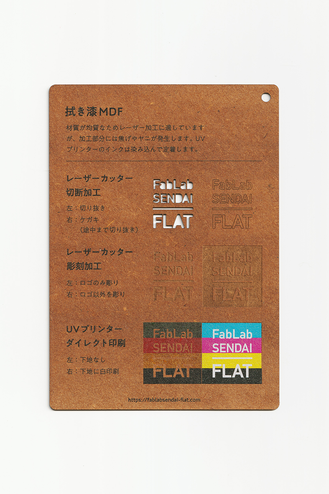
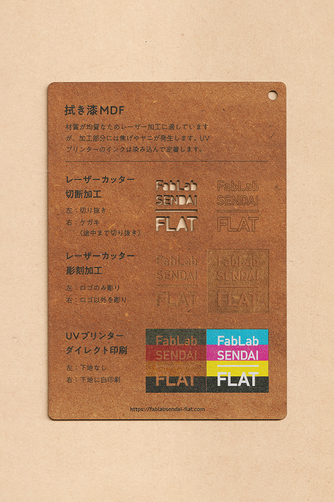

 

## 拭き漆MDF / Fuki-urushi MDF
  

MDF（中密度繊維板）の表面に漆（うるし）を染み込ませた板材です。 
材質が均質なためレーザー加工に適していますが、加工部分には焦げやヤニが発生します。 
UVプリンターのインクは染み込んで定着します。 
（用途例：アクセサリー、小物 等）
 
 

 

### **素材の作り方 / Recipe**

* [**拭き漆MDFづくりマニュアル**](https://fablabsendai.github.io/how-to-make-fukiurushimdf/)（ドキュメント）
* [**[Craft and Around Project] 拭き漆MDFづくり**](https://www.youtube.com/watch?v=F6EhHFjScXw&list=PLZnDodE3VeYUPUaUkz10JGscuksAwsW2g)（動画）

 

### **FabLab SENDAI - FLATでの加工事例（MDF全般） / Examples**

* [**レーザーカッター加工事例 / Laser Cutter**](https://www.flickr.com/search/?user_id=96175517%40N02&sort=date-taken-desc&safe_search=1&view_all=1&tags=mdflc)
* [**UVプリンター加工事例 / UV Printer**](https://www.flickr.com/search/?user_id=96175517%40N02&sort=date-taken-desc&safe_search=1&view_all=1&tags=mdfuv)

 

### **加工時の注意事項 / Notice**

**レーザーカッター / Laser Cutter**
* 焦げやヤニの付着を防ぐため、表面にマスキングテープを貼って加工すると良い。 
* 加工部分のベタつきは、ウェットティッシュ等で拭き取ると良い。 

**UVプリンター / UV Printer**
* 加工面に油分やゴミが付着しないよう、加工直前にアルコール等で拭くと良い。 

 

### **サンプル情報 / Samples**

**素材サイズ / Material Size** 
横 (W)105mm × 縦 (H)148.5mm × 厚さ (D)1.0mm 

**加工マシン / Machines** 
レーザーカッター / Laser Cutter：trotec speedy 100(60W) 
UVプリンター / UV Printer：Roland LEF-12 

**レーザー加工設定参考値 / Laser Cutter Parameters** 
切り抜き / Cut：POWER 22／SPEED 0.8 
ケガキ（途中まで切り抜き）/ Marking-Off：POWER 8／SPEED 1 
彫刻 / Engrave：POWER 50／SPEED 10／333dpi 

  

（Last Updated: 2022.10.31）

