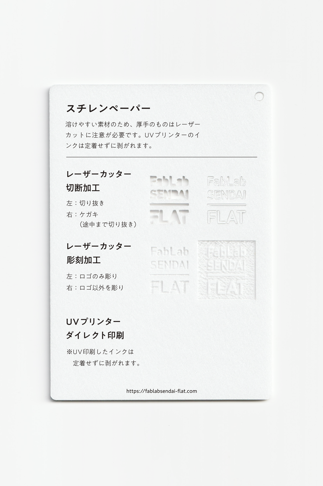

 

### スチレンペーパー / Styrene Foam Board

  

非常に軽く、目の細かい発泡スチロールボードです。 
薄手のものは綺麗にレーザーカットできますが、溶けやすいため厚手のものはカットは不向きです。 
UVプリンターのインクは定着せずに剥がれます。 
（用途例：建築模型、屋内用POP 等）
 
 

<table>
<tr style="border:none;">
<td style="border:none;"></td>
<td style="border:none;"></td>
</tr>
</table>

  

#### 加工時の注意事項 / Notice

**レーザーカッター / Laser Cutter**
 
* 厚さ1mm等薄いボードを加工する場合は、素材のズレを防ぐため、カット時はエアーをオフにすると良い。 
* 溶けやすい素材のため、厚手のものは切断面が斜めに仕上がる。 
* 彫刻面は平ではなく凸凹に仕上がる。  

**UVプリンター / UV Printer**
 
* UV印刷したインクは定着せずに剥がれます。 

  

#### サンプル情報 / Sample

**素材サイズ / Material Size** 
横 (W)105mm × 縦 (H)148.5mm × 厚さ(D)3mm

**加工マシン / Machines** 
レーザーカッター / Laser Cutter：trotec speedy 100(60W) 
UVプリンター / UV Printer：Roland LEF-12 

**レーザー加工設定参考値 / Laser Cutter Parameters** 
切り抜き：POWER 11／SPEED 1 
ケガキ（途中まで切り抜き）：POWER 6／SPEED 1 
彫刻：POWER 25／SPEED 10／333dpi 

  

（Last Updated: 2022.10.31）

