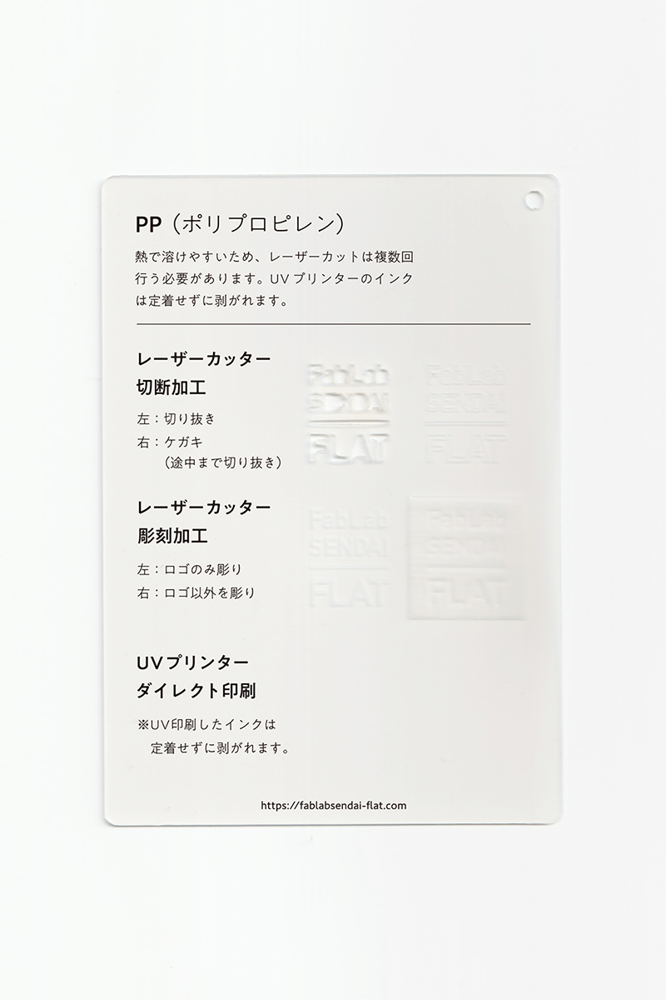

### PP（ポリプロピレン）シート
 

軽くて強度が優れており、様々な工業製品に用いられている樹脂です。 
熱で溶けやすいため、レーザーカットは複数回行う必要があります。 
UVプリンターのインクは定着せずに剥がれます。 
（用途例：収納ケース、ごみ箱、お菓子の包装 等）

 

 

  

##### 加工時の注意事項

**レーザーカッター**
 
* バリの発生や削りカスの付着を防ぐため、表面にマスキングテープを貼って加工すると良い。

**UVプリンター**
 
* UV印刷したインクは定着せずに剥がれます。

  

##### サンプル情報

* **素材サイズ** 
横105mm × 縦148.5mm × 厚さ1mm

* **加工マシン** 
レーザーカッター：trotec speedy 100(60W) 
UVプリンター：Roland LEF-12 

* **レーザー加工設定参考値** （表面にマスキングテープを貼って加工） 
切り抜き：POWER 25／SPEED 0.5 ×2回 
ケガキ（途中まで切り抜き）：POWER 12／SPEED 1 
彫刻：POWER 35／SPEED 5／333dpi 

  

（作成日・改訂日 2022.10.31作成）
