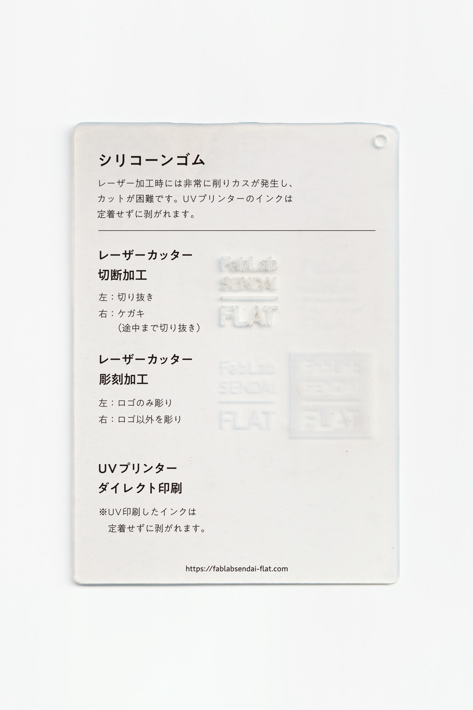

### シリコーンゴム
 

耐熱性に優れ、弾力があり、非粘着性の高いシリコーン樹脂のゴム状素材です。 
レーザー加工時には非常に削りカスが発生し、カットが困難です。 
UVプリンターのインクは定着せずに剥がれます。 
（用途例：食品の型、パッキン、チューブ 等）

 

 

  

##### 加工時の注意事項

**レーザーカッター**
 
* バリの発生や削りカスの付着を防ぐため、表面にマスキングテープを貼って加工すると良い。
（粉が非常に発生するため、加工中に発火しないよう注意。）
* 厚手のシートは切断加工できない（焦げたり燃えるだけで切り進まない）ので注意。

**UVプリンター**
 
* UV印刷したインクは定着せずに剥がれます。

  

##### サンプル情報

* **素材サイズ** 
横105mm × 縦148.5mm × 厚さ約2mm

* **加工マシン** 
レーザーカッター：trotec speedy 100(60W) 
UVプリンター：Roland LEF-12 

* **レーザー加工設定参考値** （表面にマスキングテープを貼って加工） 
切り抜き：POWER 32／SPEED 0.8 ×2回 
ケガキ（途中まで切り抜き）：POWER 8／SPEED 1 
彫刻：POWER 35／SPEED 10／333dpi 

  

（作成日・改訂日 2022.10.31作成）
