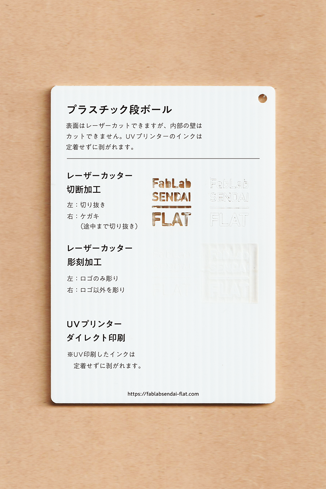

 

## プラスチック段ボール / Corrugated Plastic(PP)
  

ポリプロピレンを原料とした、プラスチック製の段ボール素材です。 
表面はレーザーカットできますが、内部の壁はカットできません。 
UVプリンターのインクは定着せずに剥がれます。 
（用途例：梱包資材、保管容器 等）
 
 

<table>
<tr style="border:none;">
<td style="border:none;"></td>
<td style="border:none;"></td>
</tr>
</table>

  

### 加工時の注意事項 / Notice
 

**レーザーカッター / Laser Cutter**
 
* バリの発生や削りカスの付着を防ぐため、表面にマスキングテープを貼って加工すると良い。 
* 溶けやすいため、レーザーカット時は低い温度でゆっくり2回加工すると良い。 
* 段ボール内部の壁はレーザーカットできない。（やや溶けるが、完全に切り抜くのは困難。）  

**UVプリンター / UV Printer**
 
* UV印刷したインクは定着せずに剥がれます。 

  

### サンプル情報 / Sample
 

**素材サイズ / Material Size** 
横 (W)105mm × 縦 (H)148.5mm × 厚さ (D)3.8mm

**加工マシン / Machines** 
レーザーカッター / Laser Cutter：trotec speedy 100(60W) 
UVプリンター / UV Printer：Roland LEF-12 

**レーザー加工設定参考値 / Laser Cutter Parameters** 
（表面にマスキングテープを貼って加工） 
切り抜き / Cut：POWER 18／SPEED 0.4 ×2回 
ケガキ（途中まで切り抜き）/ Marking-Off：POWER 18／SPEED 1 
彫刻 / Engrave：POWER 32／SPEED 15／333dpi 

  

（Last Updated: 2022.10.31）

