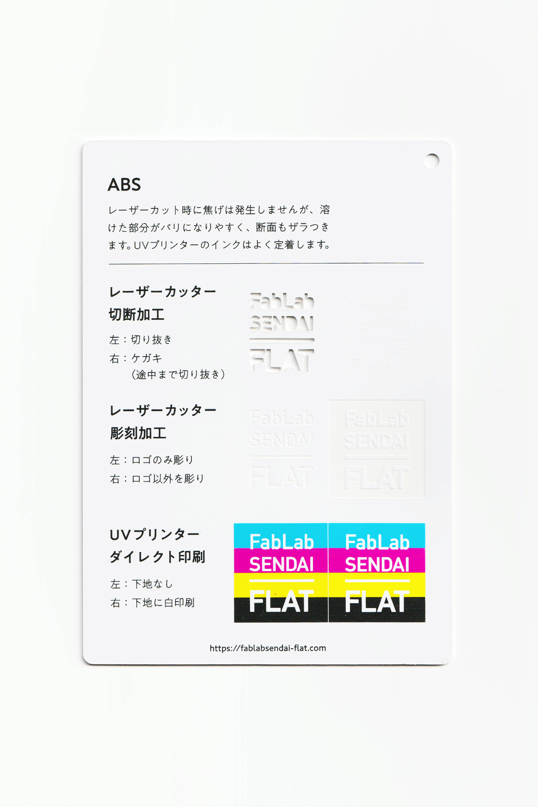
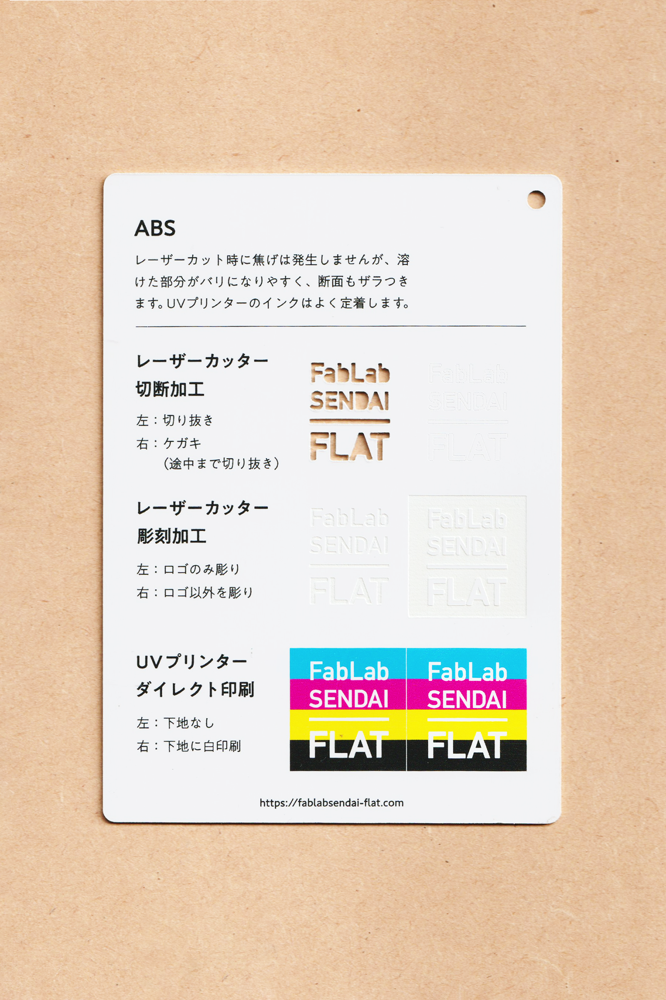

 

## ABS樹脂 / ABS
  

磨きや塗装などの加工がしやすく、様々な工業製品に用いられている樹脂です。 
レーザーカット時には焦げは発生しませんが、溶けた部分がバリになりやすく、断面もザラつきます。 
UVプリンターのインクはよく定着します。 
（用途例：自転車、家電製品、文房具 等）
 
 

 

### **加工時の注意事項 / Notice**

**レーザーカッター / Laser Cutter**
* バリの発生や削りカスの付着を防ぐため、表面にマスキングテープを貼って加工すると良い。 
* 溶けやすいため、レーザーカット時は低い温度でゆっくり加工すると良い。 

**UVプリンター / UV Printer**
* 加工面に油分やゴミが付着しないよう、加工直前にアルコール等で拭くと良い。 

 

### **サンプル情報 / Sample**

**素材サイズ / Material Size** 
横 (W)105mm × 縦 (H)148.5mm × 厚さ (D)1mm 

**加工マシン / Machines** 
レーザーカッター / Laser Cutter：trotec speedy 100(60W) 
UVプリンター / UV Printer：Roland LEF-12 

**レーザー加工設定参考値 / Laser Cutter Parameters** 
（表面にマスキングテープを貼って加工） 
切り抜き / Cut：POWER 30／SPEED 0.4 
ケガキ（途中まで切り抜き）/ Marking-Off：POWER 10／SPEED 1 
彫刻 / Engrave：POWER 40／SPEED 10／333dpi 

  

（Last Updated: 2022.10.31）

