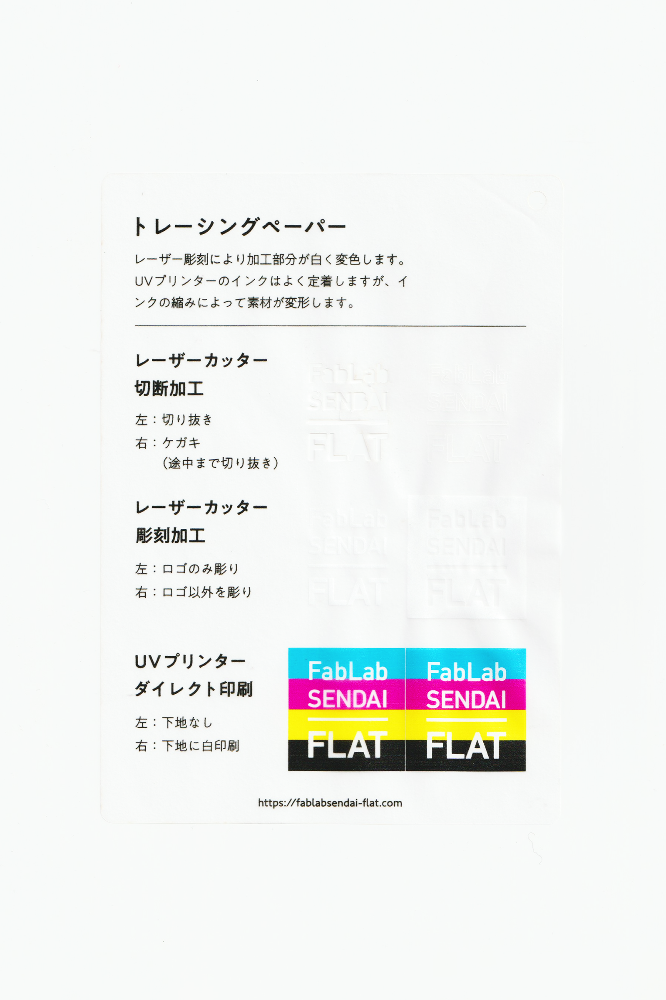

### トレーシングペーパー
 

下に敷いたものを透かして複写するための、薄い半透明の紙です。 
レーザー彫刻により加工部分が白く変色します。 
UVプリンターのインクはよく定着しますが、インクの縮みによって素材が変形します。 
（用途例：絵画制作、製図、DIY用材料 等）

 

 

  

#### FabLab SENDAI - FLATでの加工事例（紙全般）

[**レーザーカッター加工事例**](https://www.flickr.com/search/?user_id=96175517%40N02&sort=date-taken-desc&safe_search=1&view_all=1&tags=paperlc)

[**UVプリンター加工事例**](https://www.flickr.com/search/?user_id=96175517%40N02&sort=date-taken-desc&safe_search=1&view_all=1&tags=paperuv)

  

#### 加工時の注意事項

**レーザーカッター**
 
* 素材のズレを防ぐため、カット時はエアーをオフにすると良い。（発火しやすいので注意）

**UVプリンター**
 
* プリントヘッドの動きで素材が移動しないよう、テーブルにマスキングテープ等で固定すると良い。
* 印刷後、時間が経つにつれてインクが縮むため、素材が変形します。

  

#### サンプル情報

* **素材サイズ** 
横105mm × 縦148.5mm × 厚さ0.04mm

* **加工マシン** 
レーザーカッター：trotec speedy 100(60W) 
UVプリンター：Roland LEF-12 

* **レーザー加工設定参考値** 
切り抜き：POWER 5／SPEED 1 
ケガキ（途中まで切り抜き）：POWER 3／SPEED 1 
彫刻：POWER 10／SPEED 5／333dpi 

  

（作成日・改訂日 2022.10.31作成）
