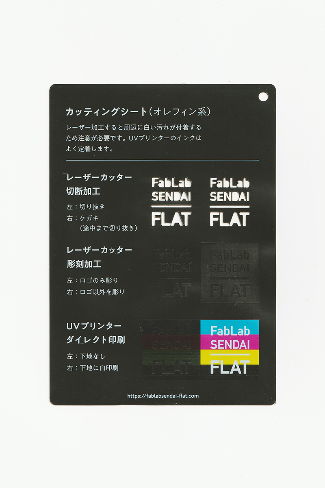
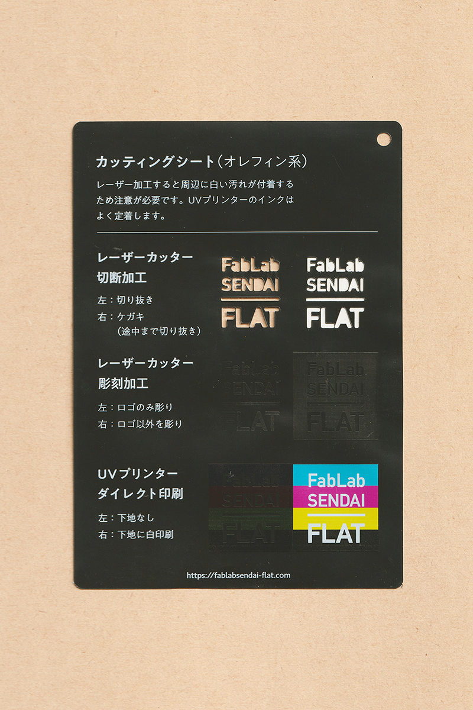

 

## カッティングシート（オレフィン系） / Olefin Sheet
  

焼却時に有害なガスが発生しない、耐水性のあるシールシートです。 
レーザー加工すると周辺に白い汚れが発生・付着します。 
レーザーのパワーを調整することで、シール部分のみをカットすることも可能です。 
UVプリンターのインクはよく定着します。 
（用途例：ウォールステッカー、家具リメイク、店内装飾 等）
 
 

 

### **加工時の注意事項 / Notice**

**レーザーカッター / Laser Cutter**
* レーザー加工時に発生した白い汚れは、ウェットティッシュ等である程度落とすことができますが、表面にマスキングテープ等を貼って加工すると尚良いでしょう。 
* 熱を与え続けると変形するため、広い面の彫刻加工は不向き。 

※一般的に販売・使用されているカッティングシートの多くは、塩化ビニル（PVC）系の素材のためレーザー加工は禁止。 
 

**UVプリンター / UV Printer**
* プリントヘッドの動きで素材が移動しないよう、テーブルにマスキングテープ等で固定すると良い。 
* 加工面に油分やゴミが付着しないよう、加工直前にアルコール等で拭くと良い。 

 

### **サンプル情報 / Sample**

**素材サイズ / Material Size** 
横 (W)105mm × 縦 (H)148.5mm × 厚さ (D)0.1mm 

**加工マシン / Machines** 
レーザーカッター / Laser Cutter：trotec speedy 100(60W) 
UVプリンター / UV Printer：Roland LEF-12 

**レーザー加工設定参考値 / Laser Cutter Parameters** 
（表面にマスキングテープを貼って加工） 
切り抜き / Cut：POWER 12／SPEED 1 
ケガキ（途中まで切り抜き）/ Marking-Off：POWER 7／SPEED 1 
彫刻 / Engrave：POWER 25／SPEED 10／333dpi 

  

（Last Updated: 2022.10.31）

