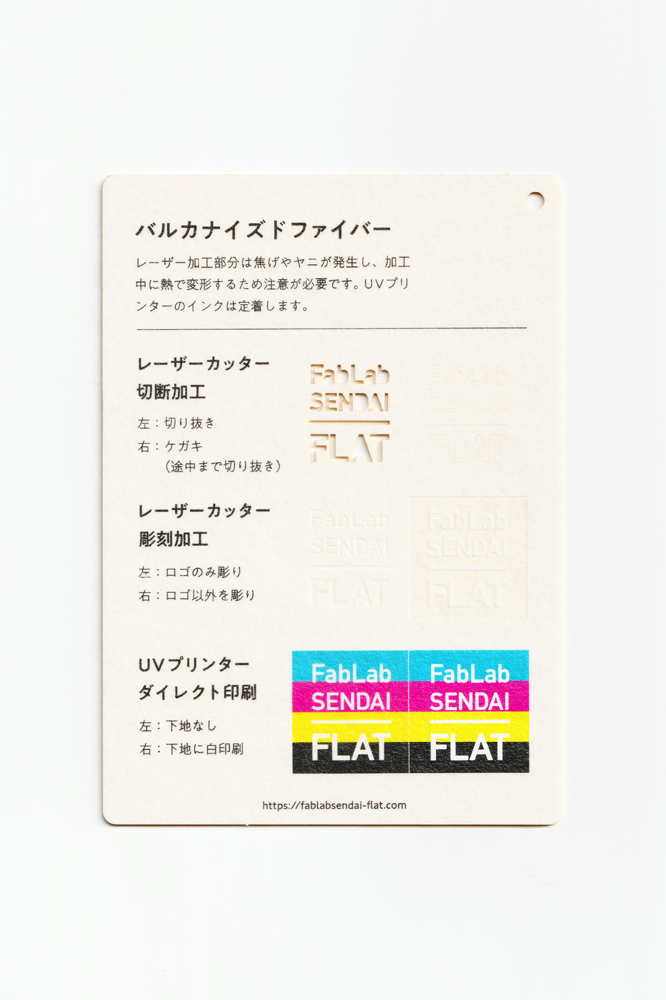

 

## バルカナイズドファイバー / Vulcanized Fiber
  

原料となる紙を特殊加工した、強靭で絶縁性のある紙素材です。 
湿らせて変形させ、そのまま乾かすと、変形させた状態のまま固まります。 
レーザー加工部分は焦げやヤニが発生し、加工中に熱で変形するため注意が必要です。 
UVプリンターのインクは定着します。 
（用途例：保管容器、電気絶縁部品、食品包装資材 等）
 
 

<table>
<tr style="border:none;">
<td style="border:none;"></td>
<td style="border:none;"></td>
</tr>
</table>

  

### FabLab SENDAI - FLATでの加工事例（紙全般） / Examples
 

[**レーザーカッター加工事例 / Laser Cutter**](https://www.flickr.com/search/?user_id=96175517%40N02&sort=date-taken-desc&safe_search=1&view_all=1&tags=paperlc)

[**UVプリンター加工事例 / UV Printer**](https://www.flickr.com/search/?user_id=96175517%40N02&sort=date-taken-desc&safe_search=1&view_all=1&tags=paperuv)

  

### 加工時の注意事項 / Notice
 

**レーザーカッター / Laser Cutter**
 
* 焦げやヤニの付着を防ぐため、表面にマスキングテープを貼って加工すると良い。 
* 加工中に熱で変形するため、ブリッジを付けたり、土台に両面テープ等で固定すると良い。 
* 加工部分のベタつきは、ウェットティッシュ等で拭き取ると良い。  

**UVプリンター / UV Printer**
 
* 加工面に油分やゴミが付着しないよう、加工直前にアルコール等で軽く拭くと良い。 

  

### サンプル情報 / Sample
 

**素材サイズ / Material Size** 
横 (W)105mm × 縦 (H)148.5mm × 厚さ (D)1.2mm

**加工マシン / Machines** 
レーザーカッター / Laser Cutter：trotec speedy 100(60W) 
UVプリンター / UV Printer：Roland LEF-12 

**レーザー加工設定参考値 / Laser Cutter Parameters** 
（表面にマスキングテープを貼って加工） 
切り抜き / Cut：POWER 38／SPEED 0.6 
ケガキ（途中まで切り抜き）/ Marking-Off：POWER 12／SPEED 1 
彫刻 / Engrave：POWER 30／SPEED 5／333dpi 

  

（Last Updated: 2022.10.31）

