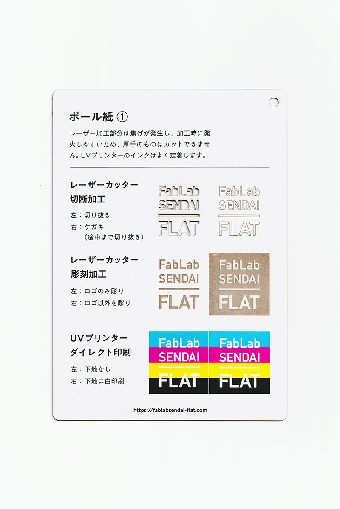

### ボール紙(1)（白面）
 

紙箱の芯紙や製本の表紙などに使用される、丈夫な厚手の紙素材です。 
レーザー加工部分は焦げが非常に発生し、加工時に発火しやすいため、厚手のものはカットできません。 
UVプリンターのインクはよく定着します。 
（用途例：紙箱の芯紙、製本の表紙 等）

 

 

  

#### FabLab SENDAI - FLATでの加工事例（紙全般）

[**レーザーカッター加工事例**](https://www.flickr.com/search/?user_id=96175517%40N02&sort=date-taken-desc&safe_search=1&view_all=1&tags=paperlc)

[**UVプリンター加工事例**](https://www.flickr.com/search/?user_id=96175517%40N02&sort=date-taken-desc&safe_search=1&view_all=1&tags=paperuv)

  

#### 加工時の注意事項

**レーザーカッター**
 
* 焦げやヤニの付着を防ぐため、表面にマスキングテープを貼って加工すると良い。
* 加工中に熱で変形するため、ブリッジを付けたり、土台に両面テープ等で固定すると良い。
* 表面に付着した焦げは、マスキングテープでくっつけて剥がすようにするとある程度取れる。

**UVプリンター**
 
* 加工面に油分やゴミが付着しないよう、加工直前にアルコール等で軽く拭くと良い。

  

#### サンプル情報

* **素材サイズ** 
横105mm × 縦148.5mm × 厚さ0.5mm

* **加工マシン** 
レーザーカッター：trotec speedy 100(60W) 
UVプリンター：Roland LEF-12 

* **レーザー加工設定参考値** 
切り抜き：POWER 19／SPEED 1 
ケガキ（途中まで切り抜き）：POWER 6／SPEED 1 
彫刻：POWER 20／SPEED 5／333dpi 

  

（作成日・改訂日 2022.10.31作成）
