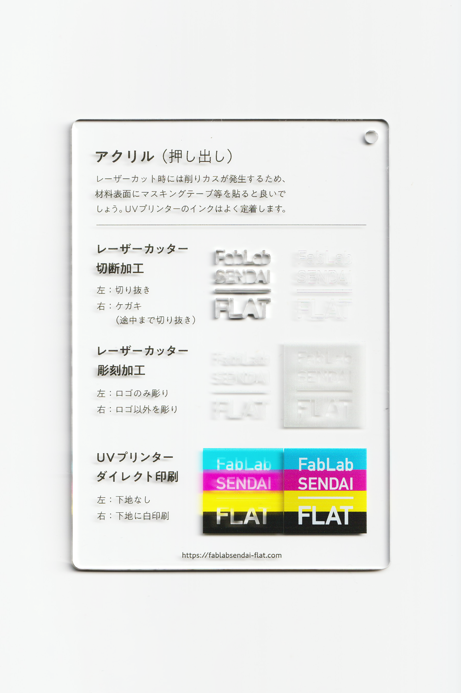

 

## アクリル / Acryl
  

切断や曲げなどの加工がしやすく、様々な工業製品に用いられている樹脂です。 
レーザーカット時には削りカスが発生するため、材料表面にマスキングテープ等を貼ると良いでしょう。 
UVプリンターのインクはよく定着します。 
（用途例：窓材、水槽、生活用品、キーホルダー 等）
 
 

 

### **FabLab SENDAI - FLATでの加工事例 / Examples**

* [**レーザーカッター加工事例 / Laser Cutter**](https://www.flickr.com/search/?user_id=96175517%40N02&sort=date-taken-desc&safe_search=1&view_all=1&tags=acryllc)
* [**UVプリンター加工事例 / UV Printer**](https://www.flickr.com/search/?user_id=96175517%40N02&sort=date-taken-desc&safe_search=1&view_all=1&tags=acryluv)

 

### **加工時の注意事項 / Notice**

**レーザーカッター / Laser Cutter**
* 削りカスの付着を防ぐため、表面にマスキングテープ等の保護紙を貼って加工すると良い。 

**UVプリンター / UV Printer**
* 加工面に油分やゴミが付着しないよう、加工直前にアルコール等で拭くと良い。 

 

### **サンプル情報 / Sample**

**素材サイズ / Material Size** 
横 (W)105mm × 縦 (H)148.5mm × 厚さ (D)3mm 

**加工マシン / Machines** 
レーザーカッター / Laser Cutter：trotec speedy 100(60W) 
UVプリンター / UV Printer：Roland LEF-12 

**レーザー加工設定参考値 / Laser Cutter Parameters** 
（表面にマスキングテープを貼って加工） 
切り抜き / Cut：POWER 72／SPEED 0.5 
ケガキ（途中まで切り抜き）/ Marking-Off：POWER 12／SPEED 1 
彫刻 / Engrave：POWER 40／SPEED 10／333dpi 

  

（Last Updated: 2022.10.31）

