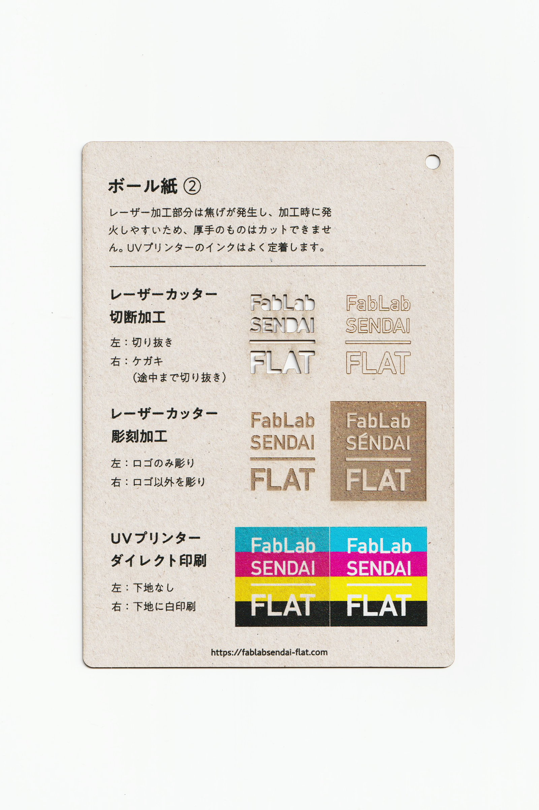

 

### ボール紙(2)（グレー面）/ Paper Board (2)

  

紙箱の芯紙や製本の表紙などに使用される、丈夫な厚手の紙素材です。 
レーザー加工部分は焦げが非常に発生し、加工時に発火しやすいため、厚手のものはカットできません。 
UVプリンターのインクはよく定着します。 
（用途例：紙箱の芯紙、製本の表紙 等）
 
 

<table>
<tr style="border:none;">
<td style="border:none;"></td>
<td style="border:none;"></td>
</tr>
</table>

  

#### FabLab SENDAI - FLATでの加工事例（紙全般）/ Examples

[**レーザーカッター加工事例 / Laser Cutter**](https://www.flickr.com/search/?user_id=96175517%40N02&sort=date-taken-desc&safe_search=1&view_all=1&tags=paperlc)

[**UVプリンター加工事例 / UV Printer**](https://www.flickr.com/search/?user_id=96175517%40N02&sort=date-taken-desc&safe_search=1&view_all=1&tags=paperuv)

  

#### 加工時の注意事項 / Notice

**レーザーカッター / Laser Cutter**
 
* 焦げやヤニの付着を防ぐため、表面にマスキングテープを貼って加工すると良い。 
* 加工中に熱で変形するため、ブリッジを付けたり、土台に両面テープ等で固定すると良い。 
* 表面に付着した焦げは、マスキングテープでくっつけて剥がすようにするとある程度取れる。  

**UVプリンター**
 
* インクが染み込みやすいため、厚盛りしたい場合は、先にグロスインク等で下地を印刷しておくと良い。 

  

#### サンプル情報 / Sample

**素材サイズ / Material Size** 
横 (W)105mm × 縦 (H)148.5mm × 厚さ (D)0.5mm

**加工マシン / Machines** 
レーザーカッター / Laser Cutter：trotec speedy 100(60W) 
UVプリンター / UV Printer：Roland LEF-12 

**レーザー加工設定参考値 / Laser Cutter Parameters** 
切り抜き / Cut：POWER 19／SPEED 1 
ケガキ（途中まで切り抜き）/ Marking-Off：POWER 6／SPEED 1 
彫刻 / Engrave：POWER 20／SPEED 5／333dpi 

  

（Last Updated: 2022.10.31）

