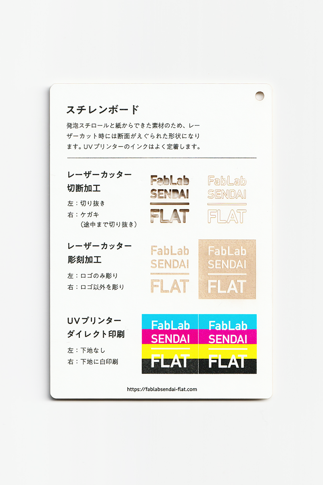
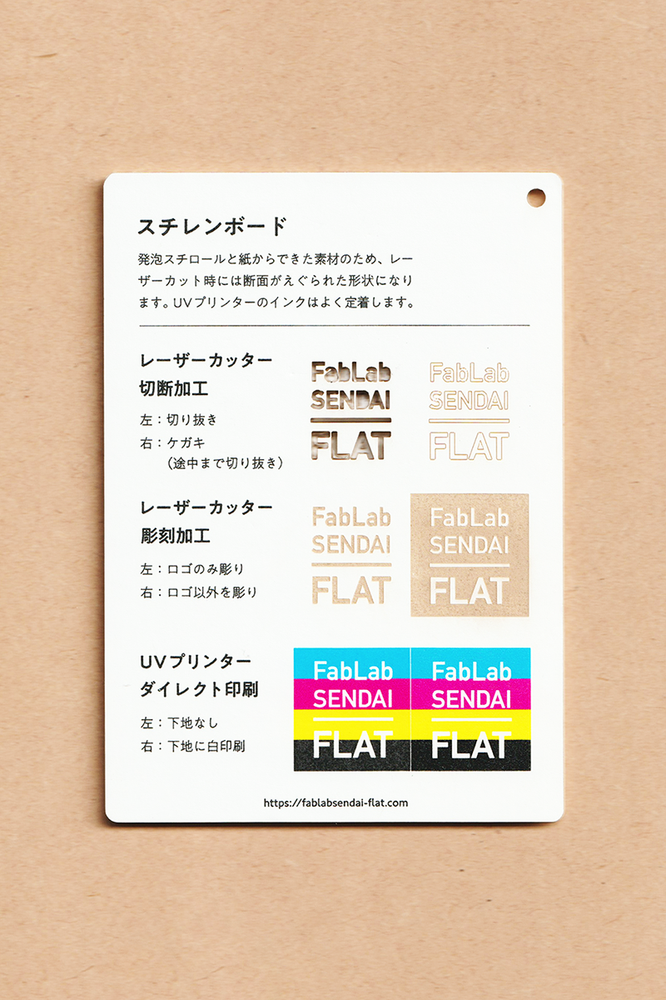

 

## スチレンボード / Foam Core Board
  

目の細かい発泡スチロールボードの両面に、上質紙等が貼られた素材です。 
発泡スチロールと紙からできた素材のため、レーザーカット時には断面がえぐられた形状になります。 
UVプリンターのインクはよく定着します。 
（用途例：建築模型、屋内用POP 等）
 
 

 

### **FabLab SENDAI - FLATでの加工事例 / Examples**

* [**レーザーカッター加工事例 / Laser Cutter**](https://www.flickr.com/search/?user_id=96175517%40N02&sort=date-taken-desc&safe_search=1&view_all=1&tags=styreneblc)

 

### **加工時の注意事項 / Notice**

**レーザーカッター / Laser Cutter**
* 表面の紙よりも、内部の発泡スチロールのほうが熱に弱いため、カット時には発泡スチロールが非常に溶けてえぐられたような形状になる。 
* 大きく単純な形状の切り抜きは可能だが、細かく複雑な形状は背面の用紙まで切り抜けない場合がある。 
* 表面の紙は、彫刻加工をすると非常に焦げカスが発生する。 

**UVプリンター / UV Printer**
* インクが染み込みやすいため、厚盛りしたい場合は、先にグロスインク等で下地を印刷しておくと良い。 

 

### **サンプル情報 / Sample**

**素材サイズ / Material Size** 
横 (W)105mm × 縦 (H)148.5mm × 厚さ (D)3mm 

**加工マシン / Machines** 
レーザーカッター / Laser Cutter：trotec speedy 100(60W) 
UVプリンター / UV Printer：Roland LEF-12 

**レーザー加工設定参考値 / Laser Cutter Parameters** 
切り抜き / Cut：POWER 19／SPEED 1 
ケガキ（途中まで切り抜き）/ Marking-Off：POWER 6／SPEED 1 
彫刻 / Engrave：POWER 25／SPEED 10／333dpi 

  

（Last Updated: 2022.10.31）

