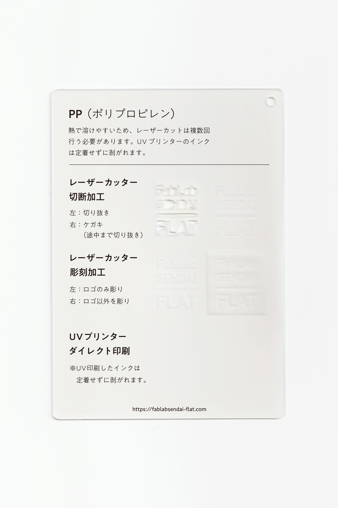

 

## PP（ポリプロピレン）シート / Polypropylene Sheet
  

軽くて強度が優れており、様々な工業製品に用いられている樹脂です。 
熱で溶けやすいため、レーザーカットは複数回行う必要があります。 
UVプリンターのインクは定着せずに剥がれます。 
（用途例：収納ケース、クリアファイル、ごみ箱、お菓子の包装 等）
 
 

 

### **FabLab SENDAI - FLATでの加工事例 / Examples**

* [**レーザーカッター加工事例 / Laser Cutter**](https://www.flickr.com/search/?user_id=96175517%40N02&sort=date-taken-desc&safe_search=1&view_all=1&tags=pplc)

 

### **加工時の注意事項 / Notice**

**レーザーカッター / Laser Cutter**
* バリの発生や削りカスの付着を防ぐため、表面にマスキングテープを貼って加工すると良い。 

**UVプリンター / UV Printer**
* UV印刷したインクは定着せずに剥がれます。 

 

### **サンプル情報 / Sample**

**素材サイズ / Material Size** 
横 (W)105mm × 縦 (H)148.5mm × 厚さ (D)1mm 

* **加工マシン** 
レーザーカッター / Laser Cutter：trotec speedy 100(60W) 
UVプリンター / UV Printer：Roland LEF-12 

* **レーザー加工設定参考値** （表面にマスキングテープを貼って加工） 
切り抜き / Cut：POWER 25／SPEED 0.5 ×2回 
ケガキ（途中まで切り抜き）/ Marking-Off：POWER 12／SPEED 1 
彫刻 / Engrave：POWER 35／SPEED 5／333dpi 

  

（Last Updated: 2022.10.31）

