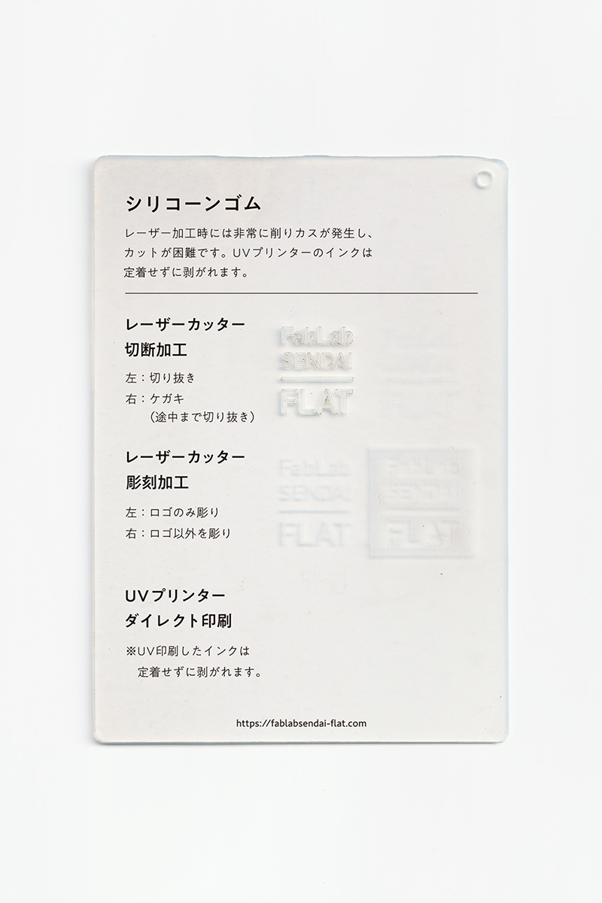
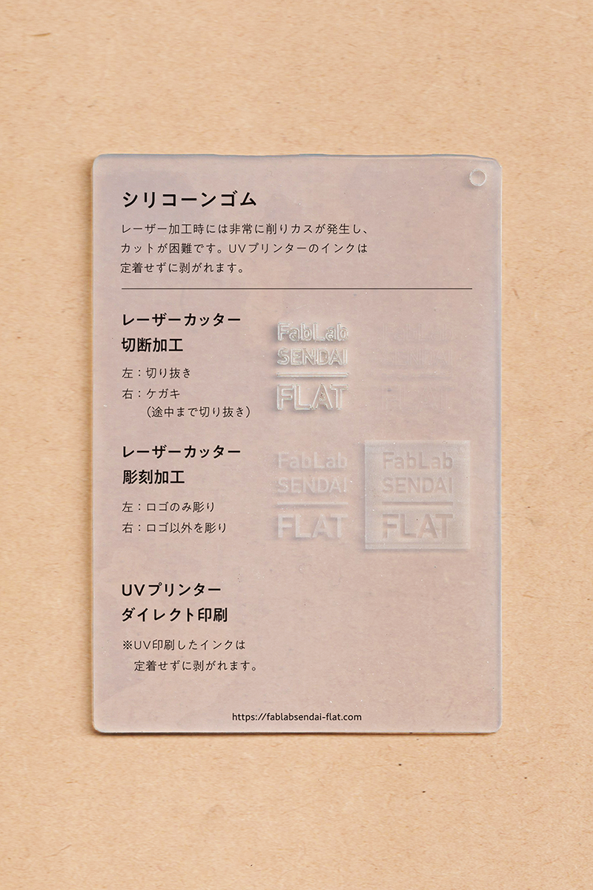

 

## シリコーンゴム / Silicone Rubber
  

耐熱性に優れ、弾力があり、非粘着性の高いシリコーン樹脂のゴム状素材です。 
レーザー加工時には非常に削りカスが発生し、カットが困難です。 
UVプリンターのインクは定着せずに剥がれます。 
（用途例：食品の型、パッキン、チューブ 等）
 
 

 

### **加工時の注意事項 / Notice**

**レーザーカッター / Laser Cutter**
* バリの発生や削りカスの付着を防ぐため、表面にマスキングテープを貼って加工すると良い。 
（粉が非常に発生するため、加工中に発火しないよう注意。） 
* 厚手のシートは切断加工できない（焦げたり燃えるだけで切り進まない）ので注意。 

**UVプリンター / UV Printer**
* UV印刷したインクは定着せずに剥がれます。 

 

### **サンプル情報 / Sample**

**素材サイズ / Material Size** 
横 (W)105mm × 縦 (H)148.5mm × 厚さ (D)約2mm 

**加工マシン / Machines** 
レーザーカッター / Laser Cutter：trotec speedy 100(60W) 
UVプリンター / UV Printer：Roland LEF-12 

**レーザー加工設定参考値 / Laser Cutter Parameters** 
（表面にマスキングテープを貼って加工） 
切り抜き / Cut：POWER 32／SPEED 0.8 ×2回 
ケガキ（途中まで切り抜き）/ Marking-Off：POWER 8／SPEED 1 
彫刻 / Engrave：POWER 35／SPEED 10／333dpi 

  

（Last Updated: 2022.10.31）

