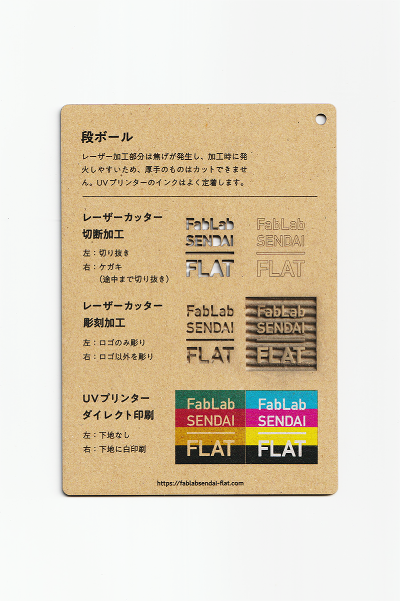
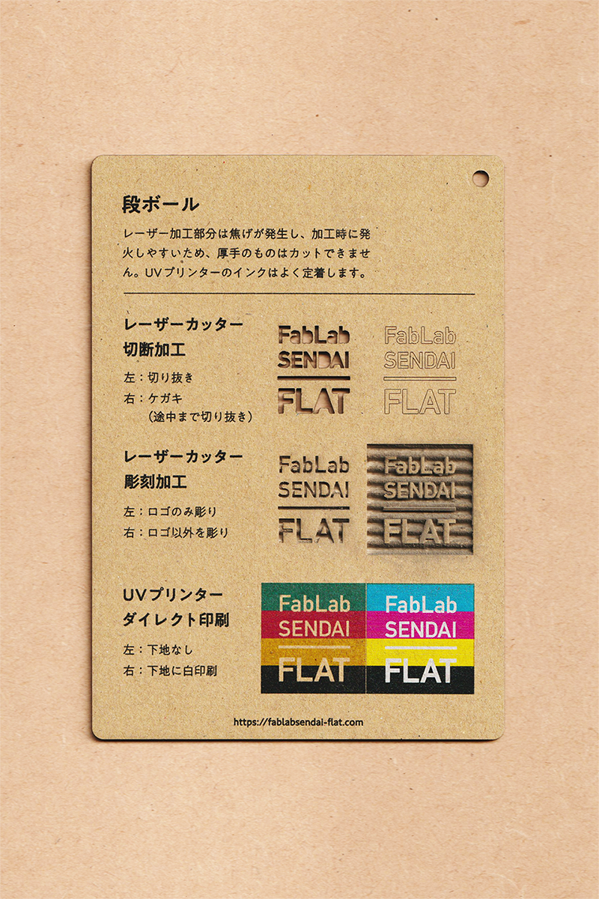

 

## 段ボール / Cardboard
  

波状の紙と平らな紙が貼り合わされて作られた紙素材です。 
レーザー加工部分は焦げが発生し、加工時に発火しやすいため、厚手のものはカットできません。 
UVプリンターのインクはよく定着します。 
（用途例：梱包資材、保管容器 等）
 
 

 

### **FabLab SENDAI - FLATでの加工事例 / Examples**

* [**レーザーカッター加工事例 / Laser Cutter**](https://www.flickr.com/search/?user_id=96175517%40N02&sort=date-taken-desc&safe_search=1&view_all=1&tags=cardboardlc)

 

### **加工時の注意事項 / Notice**

**レーザーカッター / Laser Cutter**
* 焦げやヤニの付着を防ぐため、表面にマスキングテープを貼って加工すると良い。 
* 厚手のシート（厚さ5mmを超えるものなど）は、内部に煙が溜まって燃えやすいため、カット加工に不向き。 

**UVプリンター / UV Printer**
* インクが染み込みやすいため、厚盛りしたい場合は、先にグロスインク等で下地を印刷しておくと良い。 

 

### **サンプル情報 / Sample**

**素材サイズ / Material Size** 
横 (W)105mm × 縦 (H)148.5mm × 厚さ (D)1mm 

**加工マシン / Machines** 
レーザーカッター / Laser Cutter：trotec speedy 100(60W) 
UVプリンター / UV Printer：Roland LEF-12 

**レーザー加工設定参考値 / Laser Cutter Parameters** 
切り抜き / Cut：POWER 22／SPEED 1 
ケガキ（途中まで切り抜き）/ Marking-Off：POWER 7／SPEED 1 
彫刻 / Engrave：POWER 40／SPEED 10／333dpi 

  

（Last Updated: 2022.10.31）

