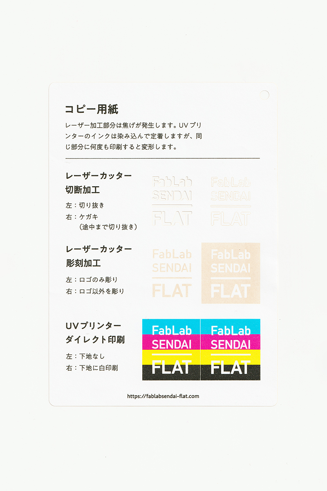
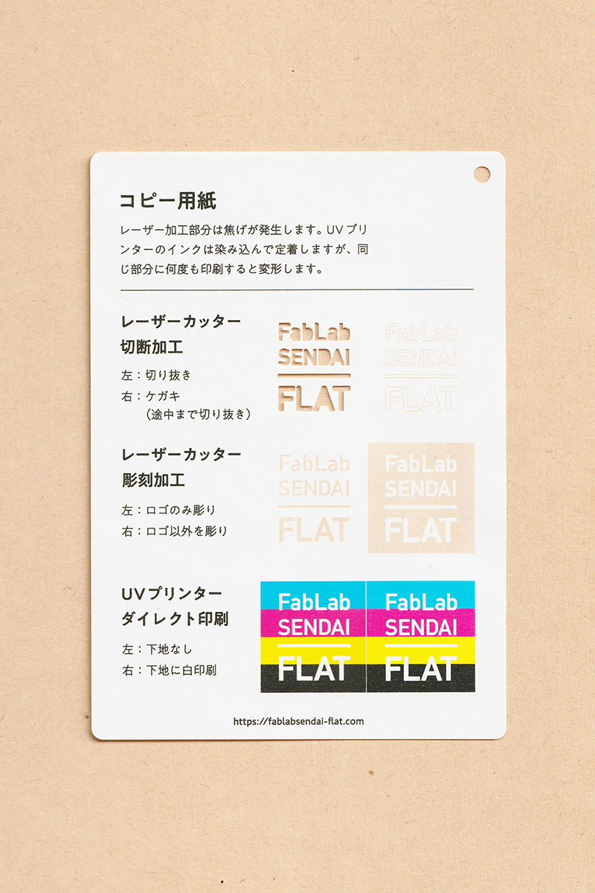

 

## コピー用紙 / Copy Paper
  

プリンター等で一般的に使用されている薄手の用紙です。 
レーザー加工部分は焦げが発生します。 
UVプリンターのインクは染み込んで定着しますが、厚く盛る（同じ部分に何度も印刷する）と変形します。 
（用途例：印刷物 等）
 
 

 

### **FabLab SENDAI - FLATでの加工事例（紙全般） / Examples**

* [**レーザーカッター加工事例 / Laser Cutter**](https://www.flickr.com/search/?user_id=96175517%40N02&sort=date-taken-desc&safe_search=1&view_all=1&tags=paperlc)

* [**UVプリンター加工事例 / UV Printer**](https://www.flickr.com/search/?user_id=96175517%40N02&sort=date-taken-desc&safe_search=1&view_all=1&tags=paperuv)

 

### **加工時の注意事項 / Notice**

**レーザーカッター / Laser Cutter**
* 素材のズレを防ぐため、カット時はエアーをオフにすると良い。（発火しやすいので注意） 

**UVプリンター / UV Printer**
* プリントヘッドの動きで素材が移動しないよう、テーブルにマスキングテープ等で固定すると良い。 

 

### **サンプル情報 / Sample**

**素材サイズ / Material Size** 
横 (W)105mm × 縦 (H)148.5mm × 厚さ (D)0.09mm 

**加工マシン / Machines** 
レーザーカッター / Laser Cutter：trotec speedy 100(60W) 
UVプリンター / UV Printer：Roland LEF-12 

**レーザー加工設定参考値 / Laser Cutter Parameters** 
切り抜き / Cut：POWER 6／SPEED 1 
ケガキ（途中まで切り抜き）/ Marking-Off：POWER 3／SPEED 1 
彫刻 / Engrave：POWER 18／SPEED 10／333dpi 

  

（Last Updated: 2022.10.31）

