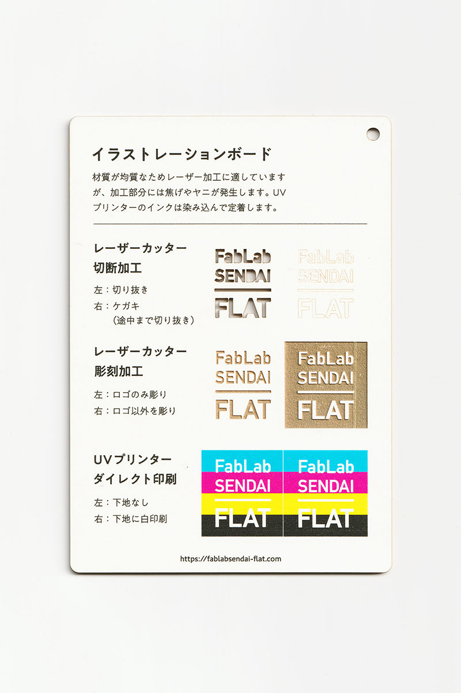
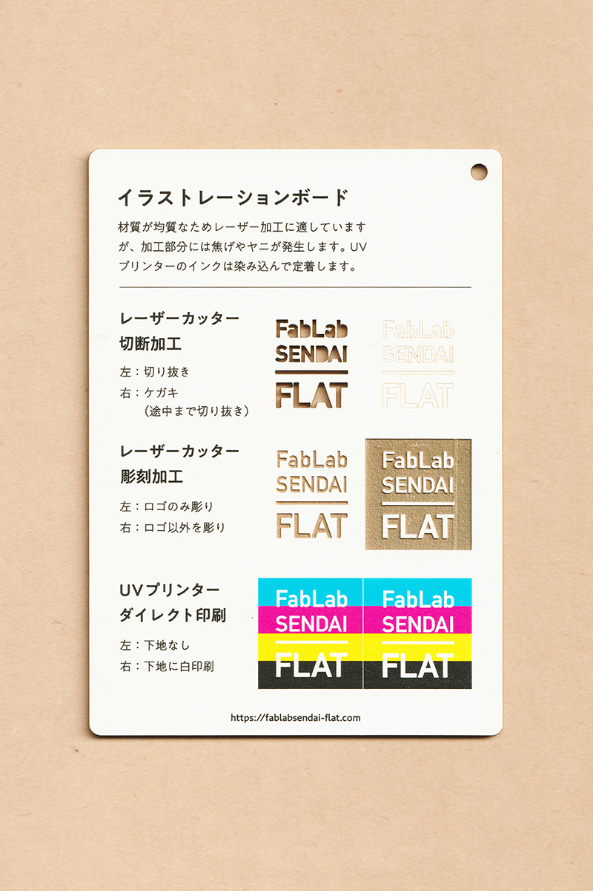

 

## イラストレーションボード / Illustration Board
  

厚紙の表面に、ケント紙や色紙など様々な用紙が貼られたボードです。 
材質が均質なためレーザー加工に適していますが、加工部分には焦げやヤニが発生します。 
UVプリンターのインクは染み込んで定着します。 
（用途例：ドローイング、額装、建築模型 等）
 
 

 

### **FabLab SENDAI - FLATでの加工事例（紙全般）/ Examples**

* [**レーザーカッター加工事例 / Laser Cutter**](https://www.flickr.com/search/?user_id=96175517%40N02&sort=date-taken-desc&safe_search=1&view_all=1&tags=paperlc)
* [**UVプリンター加工事例 / UV Printer**](https://www.flickr.com/search/?user_id=96175517%40N02&sort=date-taken-desc&safe_search=1&view_all=1&tags=paperuv)

 

### **加工時の注意事項 / Notice**

**レーザーカッター / Laser Cutter**
* 焦げやヤニの付着を防ぐため、表面にマスキングテープを貼って加工すると良い。 
* ただし、マスキングテープを剥がす際に、表面の用紙も剥がれてしまうことがあるので注意。 

**UVプリンター**
* インクが染み込みやすいため、厚盛りしたい場合は、先にグロスインク等で下地を印刷しておくと良い。 

 

### **サンプル情報 / Sample**

**素材サイズ / Material Size** 
横 (W)105mm × 縦 (H)148.5mm × 厚さ (D)2.0mm 

**加工マシン / Machines** 
レーザーカッター / Laser Cutter：trotec speedy 100(60W) 
UVプリンター / UV Printer：Roland LEF-12 

**レーザー加工設定参考値 / Laser Cutter Parameters** 
切り抜き / Cut：POWER 38／SPEED 0.8 
ケガキ（途中まで切り抜き）/ Marking-Off：POWER 8／SPEED 1 
彫刻 / Engrave：POWER 40／SPEED 10／333dpi 

  

（Last Updated: 2022.10.31）

