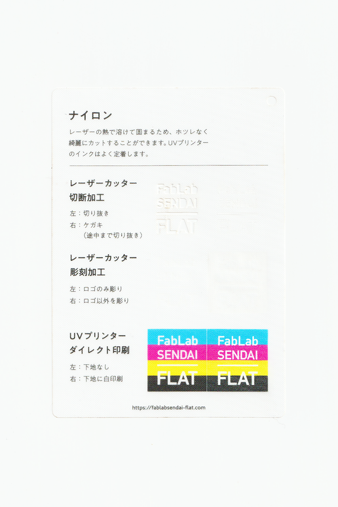

### ナイロン（100%）布
 

摩擦に強くて耐久性の高い、軽い布素材です。 
レーザーの熱で溶けて固まるため、ホツレなく綺麗にカットすることができます。 
UVプリンターのインクはよく定着します。 
（用途例：衣類、服飾雑貨 等）

 

 

  

##### 加工時の注意事項

**レーザーカッター**
 
* 素材のズレを防ぐため、カット時はエアーをオフにすると良い。（発火しやすいので注意）

**UVプリンター**
 
* プリントヘッドの動きで素材が移動しないよう、テーブルにマスキングテープ等で固定すると良い。

  

##### サンプル情報

* **素材サイズ** 
横105mm × 縦148.5mm × 厚さ0.03mm

* **加工マシン** 
レーザーカッター：trotec speedy 100(60W) 
UVプリンター：Roland LEF-12 

* **レーザー加工設定参考値** 
切り抜き：POWER 8／SPEED 1 
ケガキ（途中まで切り抜き）：POWER 5／SPEED 1 
彫刻：POWER 13／SPEED 5／333dpi 

  

（作成日・改訂日 2022.10.31作成）
