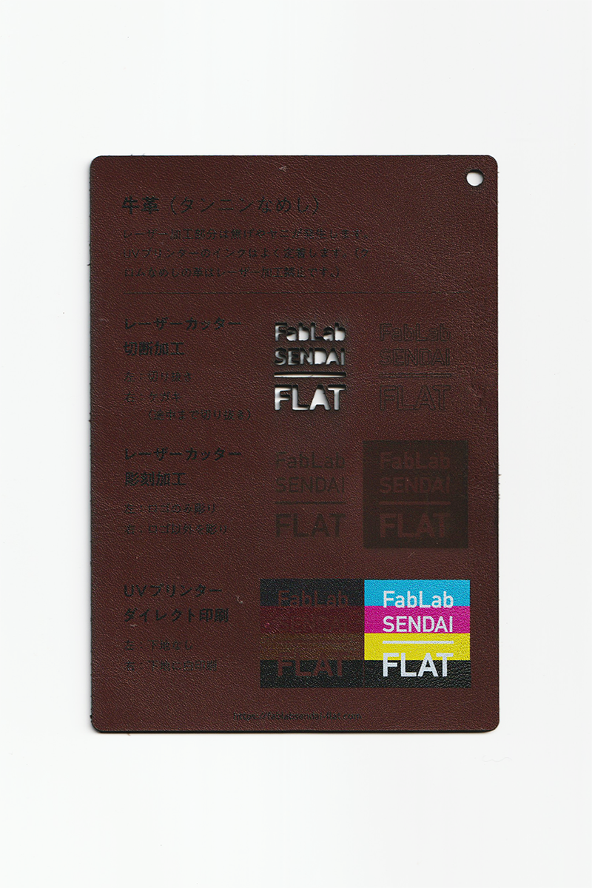
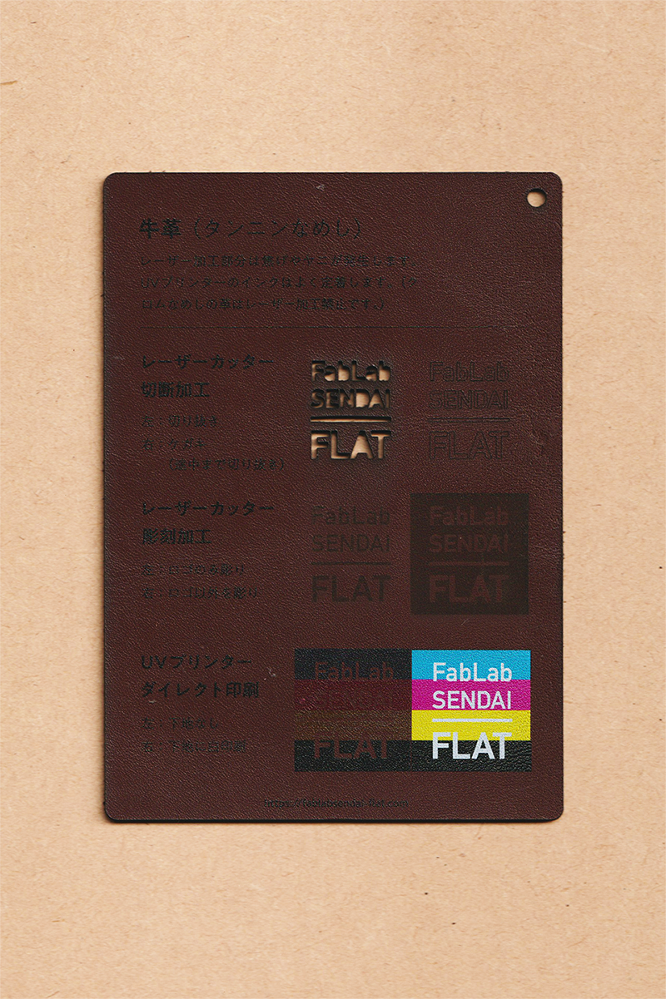

 

## 牛革（タンニンなめし）/ Cow Leather
  

植物の樹皮などに含まれるタンニンを使用して加工された牛革です。 
レーザー加工部分は焦げやヤニが発生します。 
UVプリンターのインクはよく定着します。 
（クロムなめしの革はレーザー加工禁止です。） 
（使用例：服飾雑貨、生活雑貨、DIY用材料 等）
 
 

 

### **FabLab SENDAI - FLATでの加工事例 / Examples**

* [**レーザーカッター加工事例 / Laser Cutter**](https://www.flickr.com/search/?user_id=96175517%40N02&sort=date-taken-desc&safe_search=1&view_all=1&tags=leatherlc)
* [**UVプリンター加工事例 / UV Printer**](https://www.flickr.com/search/?user_id=96175517%40N02&sort=date-taken-desc&safe_search=1&view_all=1&tags=leatheruv)

 

### **加工時の注意事項 / Notice**

**レーザーカッター / Laser Cutter**
* 焦げやヤニの付着を防ぐため、表面にマスキングテープを貼って加工すると良い。 
* 厚手の革は切断加工できない（焦げたり燃えるだけで切り進まない）ので注意。 
* クロムなめしの革は、有毒ガスが発生するためレーザー加工禁止。 

**UVプリンター / UV Printer**
* 加工面に油分やゴミが付着しないよう、加工直前にアルコール等で拭くと良い。 

 

### **サンプル情報 / Sample**

**素材サイズ / Material Size** 
横 (W)105mm × 縦 (H)148.5mm × 厚さ (D)1.5mm 

**加工マシン / Machines** 
レーザーカッター / Laser Cutter：trotec speedy 100(60W) 
UVプリンター / UV Printer：Roland LEF-12 

**レーザー加工設定参考値 / Laser Cutter Parameters** 
切り抜き / Cut：POWER 34／SPEED 0.8 
ケガキ（途中まで切り抜き）/ Marking-Off：POWER 6／SPEED 1 
彫刻 / Engrave：POWER 30／SPEED 10／333dpi 

  

（Last Updated: 2022.10.31）

