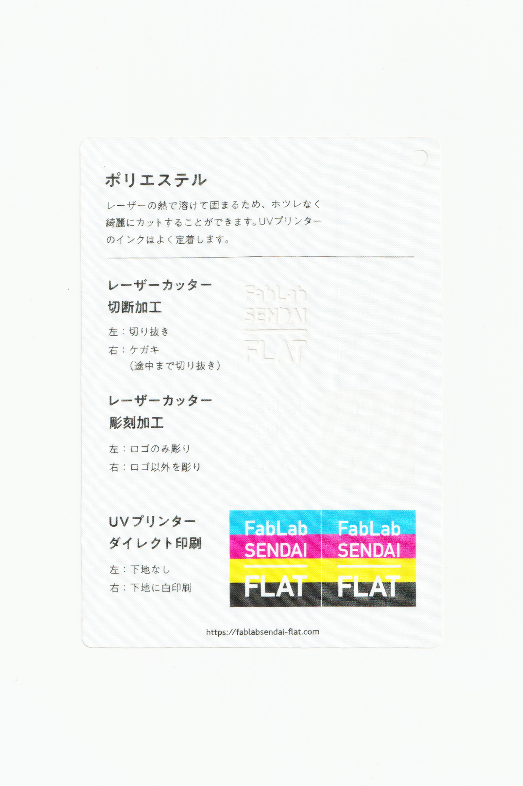

 

## ポリエステル（100%）布 / Polyester Fabric
  

耐久性が高くてシワになりにくい、軽い布素材です。 
レーザーの熱で溶けて固まるため、ホツレなく綺麗にカットすることができます。 
UVプリンターのインクはよく定着します。 
（用途例：衣類、服飾雑貨 等）
 
 

<table>
<tr style="border:none;">
<td style="border:none;"></td>
<td style="border:none;"></td>
</tr>
</table>

  

### FabLab SENDAI - FLATでの加工事例 / Examples
 

[**レーザーカッター加工事例 / Laser Cutter**](https://www.flickr.com/search/?user_id=96175517%40N02&sort=date-taken-desc&safe_search=1&view_all=1&tags=polyesterlc)

  

### 加工時の注意事項 / Notice
 

**レーザーカッター / Laser Cutter**
 
* 素材のズレを防ぐため、カット時はエアーをオフにすると良い。（発火しやすいので注意）  

**UVプリンター / UV Printer**
 
* プリントヘッドの動きで素材が移動しないよう、テーブルにマスキングテープ等で固定すると良い。 

  

### サンプル情報 / Sample
 

**素材サイズ / Material Size** 
横 (W)105mm × 縦 (H)148.5mm × 厚さ (D)0.03mm

**加工マシン / Machines** 
レーザーカッター / Laser Cutter：trotec speedy 100(60W) 
UVプリンター / UV Printer：Roland LEF-12 

**レーザー加工設定参考値 / Laser Cutter Parameters** 
切り抜き / Cut：POWER 5／SPEED 1 
ケガキ（途中まで切り抜き）/ Marking-Off：POWER 3／SPEED 1 
彫刻 / Engrave：POWER 11／SPEED 5／333dpi 

  

（Last Updated: 2022.10.31）

