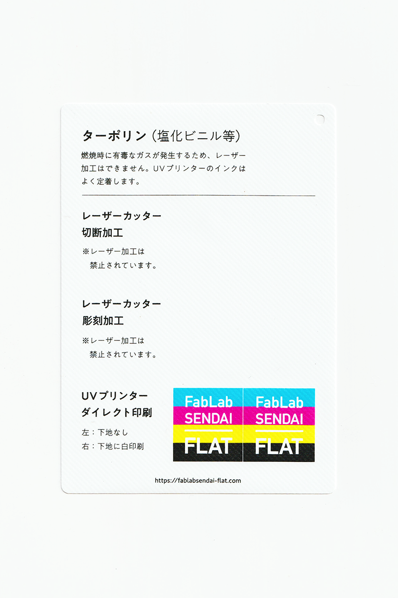

### ターポリン（塩化ビニル等）
 

合成繊維の織物の両面に塩化ビニル樹脂を積層した、丈夫で強い素材です。 
有毒なガスが発生するため、レーザー加工はできません。 
カットにはカッティングプロッタを使用します。 
UVプリンターのインクはよく定着します。 
（用途例：横断幕、工事現場のシート、バッグ 等）

 

 

  

#### 加工時の注意事項

**レーザーカッター**
 
※加工時に有毒なガスが発生するため、レーザー加工は禁止。

**UVプリンター**
 
* 加工面に油分やゴミが付着しないよう、加工直前にアルコール等で拭くと良い。
* 印刷後、時間が経つにつれてインクが縮むため、素材が変形します。

  

#### サンプル情報

* **素材サイズ** 
横105mm × 縦148.5mm × 厚さ0.2mm

* **加工マシン** 
UVプリンター：Roland LEF-12 

  

（作成日・改訂日 2022.10.31作成）
