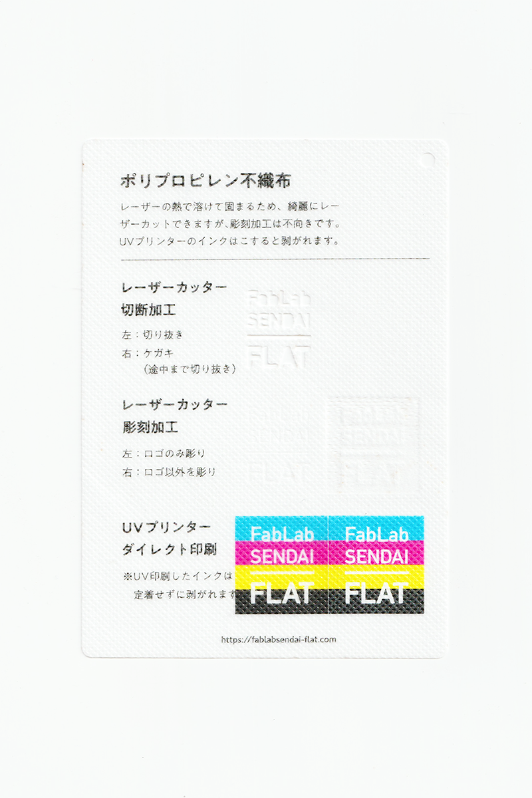

### 不織布（PP）
 

ポリプロピレン繊維を絡み合わせて、接着剤や熱で結合させた布素材です。 
レーザーの熱で溶けて固まるため、綺麗にレーザーカットできますが、彫刻加工は不向きです。 
UVプリンターのインクはこすると剥がれます。 
（用途例：手芸、生活雑貨、衣類、服飾雑貨 等）

 

 

  

#### FabLab SENDAI - FLATでの加工事例（布全般）

[**レーザーカッター加工事例**](https://www.flickr.com/search/?user_id=96175517%40N02&sort=date-taken-desc&safe_search=1&view_all=1&tags=fabriclc)

  

#### 加工時の注意事項

**レーザーカッター**
 
* 素材のズレを防ぐため、カット時はエアーをオフにすると良い。（発火しやすいので注意）

**UVプリンター**
 
* UVプリンターのインクはこすると剥がれます。
* プリントヘッドの動きで素材が移動しないよう、テーブルにマスキングテープ等で固定すると良い。
* 表面に毛羽立ちがあるとかすれが発生するため、加工前にアイロンなどで表面を整えておくと良い。

  

#### サンプル情報

* **素材サイズ** 
横105mm × 縦148.5mm × 厚さ0.2mm

* **加工マシン** 
レーザーカッター：trotec speedy 100(60W) 
UVプリンター：Roland LEF-12 

* **レーザー加工設定参考値** 
切り抜き：POWER 6／SPEED 1 
ケガキ（途中まで切り抜き）：POWER 4／SPEED 1 
彫刻：POWER 12／SPEED 5／333dpi 

  

（作成日・改訂日 2022.10.31作成）
