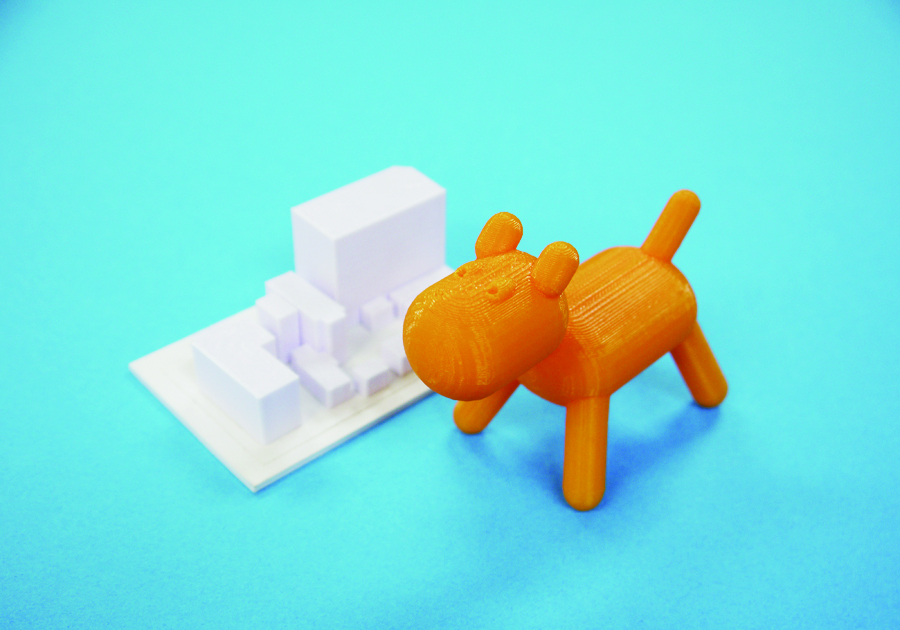

 

## 3Dプリンターとは
 
 

  

パソコン等で作成された3Dデータを元に、樹脂材料を積層して（積み重ねて）立体形状を造形するマシンです。様々な造形方法のものがありますが、ここでは操作が容易で安価なFDM（熱溶解積層）方式の3Dプリンターについて説明します。 
FDM方式の3Dプリンターは、フィラメントと呼ばれるスパゲッティのように細い形状の材料を熱で溶かし、ソフトクリームのように積み重ねて造形を行います。（造形サイズや使用できる材料の種類は、使用するマシンや機種により異なります。）
 
 

---

 

### **3Dプリンターでの加工事例**

FabLab SENDAI - FLAT UVプリンター加工事例 
[https://www.flickr.com/photos/flat-sendai/albums/72157679861997664](https://www.flickr.com/photos/flat-sendai/albums/72157679861997664) 

 

### **加工に必要なデータ形式例**

.stl, .obj等（立体物を造形するため、3Dデータが必須です。） 

 

### **データ作成に使用するソフトウェアの例**

**3D CAD （部品など、寸法が重要なものを設計する場合向き）**

* Rhinoceros （有料）：[http://www.rhino3d.co.jp/](http://www.rhino3d.co.jp/)
* Tinkercad（無料）：[https://www.tinkercad.com/](https://www.tinkercad.com/)
* Autodesk FUSION360（一部有料）：[http://www.autodesk.co.jp/products/fusion-360/overview](http://www.autodesk.co.jp/products/fusion-360/overview)
* Shaper3D（一部有料）：[https://www.shapr3d.com/](https://www.shapr3d.com/)

 

**3D CG （フィギュアなど、粘土を使った有機的な造形などを行いたい場合向き）**

* SculptGL（無料）：[https://stephaneginier.com/sculptgl/](https://stephaneginier.com/sculptgl/)
* Blender（無料）：[https://blender.jp/](https://blender.jp/)

 

**データダウンロードサイト**

* Thingiverse：[https://www.thingiverse.com/](https://www.thingiverse.com/)

 
 
 