 

## (1)アクリル等樹脂の色付け（染色）
  

アクリル板等の樹脂は、塗料が剥がれやすく塗装が難しい素材の一つです。 
材料を作る時点であれば着色料を混ぜ込むこともできますが、造形後の樹脂には“染色”という方法で色を付けることができます。 
 
 

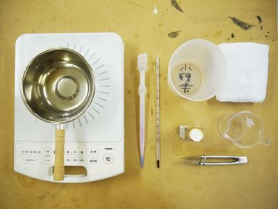

### **0. 材料・道具**

* 染料 （ここでは[樹脂用染料SDN](https://osaka-kaseihin.co.jp/?page_id=274)を使用） 
* 小鍋 
* 加熱用器具（カセットコンロなど） 
* スポイト（1ml単位で計量できるもの） 
* 計量カップ 
* 温度計 
* 素材洗浄用水（カップ等に用意する） 
* 中性洗剤 
* トングや箸など 

 

 

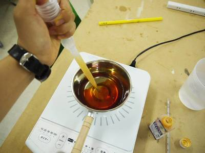

### **1. 染色溶液の用意**

商品説明書に記載された手順で、染色したいパーツがしっかり浸かる液量の染色溶液を用意する。
 
（SDNの場合は、水：SDN（染料）＝20：1となるよう混合する。）<be>

 

  

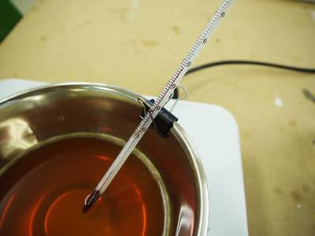

### **2. 染色溶液の加熱**

染色する素材に合わせて、温度を調整しながら溶液を加熱する。 
（アクリル、ナイロンなど、各樹脂の適正温度は、染色液の説明書等を確認する。） 
ダブルクリップを使って、温度計を鍋に固定すると良い。<be>

 

  

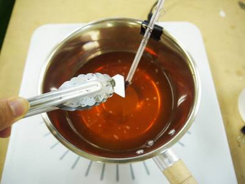

### **3. 素材の染色**

染色したい素材を加熱された溶液へ入れ、攪拌する。 
（素材はあらかじめ水で洗い、表面についたゴミや油分を取り除いておく。） 

 

  

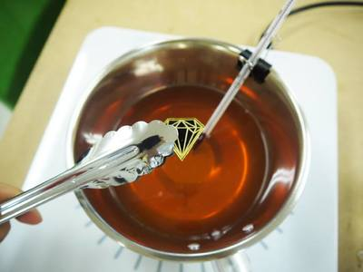

### **4. 素材の取り出し・洗浄**

素材が希望の色になったら鍋から取り出し、中性洗剤と洗浄用の水で洗う。 
十分に洗ったら乾燥させる。

 

  

---

  

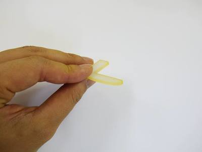

### **応用1. マスキングでの染め分け**

養生テープやビニールテープ等を染めたくない部分に貼ることで、素材の染め分けができる。 

 

  

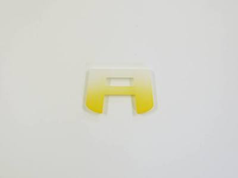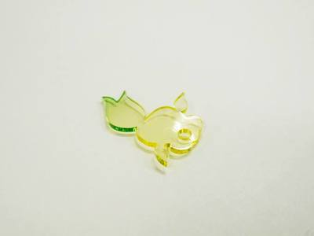

### **応用2. グラデーション染め**

素材の一部だけが溶液に浸かるように染色をすると、きれいなグラデーションになる。 
2色以上のグラデーションをする場合は、明るい色から染色をすると良い。 

 

  

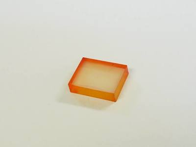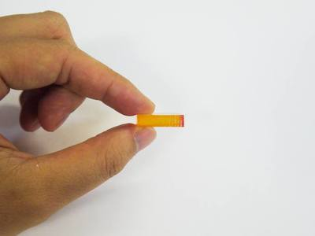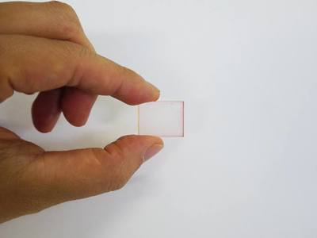

### **応用3. 2色グラデーション+くもり仕上げ**

広い面にビニールテープを貼り、橙色→桃色の順に染色。その後、テープを貼っていた部分にのみ#1200のペーパーをかけてすりガラスのように加工。 
橙色は2分程度、桃色は10秒程度しか染色していないため、面によって色の見え方が異なる。 

 

  

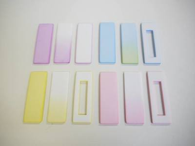

### **応用4. 白色アクリルの染色**

白色アクリルは色ムラが目立ちやすいため、染色溶液に沈殿物等が入っていないか確認した上で染色したほうが良い。 

 

  

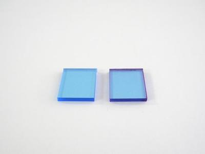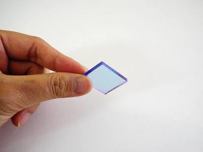

### **応用5. 色付きアクリルの染色**

元々青色のアクリル板を染色。左がもとのアクリル板、右が紫色の染料に10秒程浸けたもの。 
マスキングはしていないが、側面のみ色が強く出ているのが分かる。 

 

   

（Last Updated: 2022.10.31）

