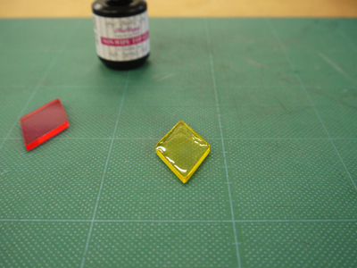

 

## (2)UVレジンによるアクリル板の接着
  

アクリル板同士をくっつけたい時、ほとんどの場合ではアクリル板自体を液剤で溶かして貼り合わせる“溶着”を行います。ただ“溶着”は、広い面同士をくっつけようとすると気泡が入ってしまうなど、やや難易度が高い方法です。だからと言って、ボンドなどで“接着”した場合、接着面が白くなってしまったり、簡単にはがれてしまうこともあります。 
そこでここでは、ボンドなどよりも透明度が高く、溶着剤よりも扱いやすい、UVレジンを使用したアクリル板の“接着”方法をご紹介します。 
（※“溶着”に比べて、この方法で“接着”したパーツははがれやすいため、強い力のかかる部分への使用には適していません。） 
（※UVレジンを使用する際には、必ずゴム手袋等を装着してください！） 
 
 

<h3><strong> 0. 材料・道具 </strong></h3>

・UVレジン （ジェルネイル用マニキュアでも代用可） 
・UVライト 

 

  

<h3><strong>1. 接着するアクリル板の用意</strong></h3>

この接着方法ではUVライトを使用するため、接着するアクリル板のどちらかは必ず光を通すもの（透明なもの）であること。 

 

  

<h3><strong>2. UVレジンの塗布</strong></h3>

片方のアクリル板に、たっぷりとまんべんなくUVレジンを塗る。 

 

 

  

<h3><strong>3. アクリル板の重ね合わせ</strong></h3>

アクリル板同士を重ね、指で強く押してくっつける。横からUVレジンがはみ出すくらい密着させたら、はみ出した分はウェットティッシュ等で拭き取る。 

 

  

<h3><strong>4. UVライトでの硬化</strong></h3>

UVライトで硬化させ、完全に硬化したら完成。

 

 

 
  

---

  

<h3><strong>応用1. アクリル板とMDFの接着</strong></h3>

UVレジンがMDFに染み込んでやや変色した。 

 

 

  

<h3><strong>応用2. アクリル板と和紙の接着</strong></h3>

和紙にUVレジンがよく染み込むため、まだら模様になり、とてもはがれやすい。 

 

 

  

<h3><strong>応用3. アクリル板と布の接着</strong></h3>

布にUVレジンがよく染み込むため、まだら模様になり、とてもはがれやすい。 

 

  

<h3><strong>応用4. アクリル板とフェルトの接着</strong></h3>

接着面にたくさんの気泡が発生した。 

 

   

（Last Updated: 2022.10.31）

