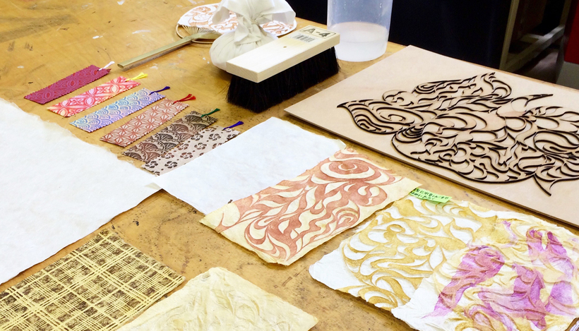

 

## (5)レーザーカットした板木による拓本染め
  

拓本染めとは、宮城県白石市で製造されている「白石和紙」を用いた加工技法のひとつで、凹凸のある版木にこんにゃく糊を染み込ませた和紙を密着させ、凸部分にタンポで色をのせていくというものです。 
ここでは、レーザーカッターで制作した版木を使って行う拓本染めの方法をご紹介します。 
実施例：[特別レクチャー@宮城大学『手漉き和紙と、レーザーカッターを用いた拓本の制作』](https://fablabsendai-flat.com/2017/05/13/myu_17041722/)
 
 

 
 

<h3><strong> 0. 材料・道具 </strong></h3>

* 版木 
* ブラシ（馬毛等） 
* タオル 
* 定規 
* 新聞紙 
* ゴムローラー 
* タンポ 
* 絵具 
* こんにゃく糊 

---

**こんにゃく糊の作り方** 
ペットボトル等に、水1Lにこんにゃく粉5g程度を入れて撹拌し静置する。しばらくすると粉が沈殿するので、その都度撹拌と静置を繰り返し、粉が全て水になじんだら完成。 
保存する場合は冷蔵庫などへ入れておく。（ただし匂いがどんどんキツくなるため、3日程度で使い切ることが望ましい。）
使用する際の気温や用途に応じて水と粉の比率は変更する。（拓本染めの場合、粘度が高すぎると使いにくい。ゆるめのあんかけ程度でOK。） 

---

 

<h3><strong>1. こんにゃく糊の揉み込み</strong></h3>

和紙にこんにゃく糊を塗る。このときに、糊が全体に行き渡るようにしっかり揉み込む。 

<iframe width="560" height="315" src="https://www.youtube.com/embed/21a0GCSInzE" title="YouTube video player" frameborder="0" allow="accelerometer; autoplay; clipboard-write; encrypted-media; gyroscope; picture-in-picture" allowfullscreen></iframe>

  

<h3><strong>2. 版木への水の塗布</strong></h3>

和紙のなじみが良くなるように、版木全体に水を塗布する。 
なるべく表面に水滴が残らないよう、しっかりと染み込ませる。 
このときに、版木の表面についているゴミも拭き取る。 

<iframe width="560" height="315" src="https://www.youtube.com/embed/tSqiyMqbm-w" title="YouTube video player" frameborder="0" allow="accelerometer; autoplay; clipboard-write; encrypted-media; gyroscope; picture-in-picture" allowfullscreen></iframe>

  

<h3><strong>3. 和紙の圧着</strong></h3>
 

版木に和紙をのせ、ブラシで真上から叩いて圧着させる。（ここでは馬毛ブラシを使用。） 
版木が乾いてきたり、ブラシで和紙を引きずると和紙が剥がれてきてしまうので注意する。 

<iframe width="560" height="315" src="https://www.youtube.com/embed/jaGM6Zmiops" title="YouTube video player" frameborder="0" allow="accelerometer; autoplay; clipboard-write; encrypted-media; gyroscope; picture-in-picture" allowfullscreen></iframe>

  

<h3><strong>4. 新聞紙での吸水</strong></h3>

これから色を付ける凸部分に余分な水分が無いよう、和紙に新聞を押し当てて給水する。余分な水分があると、色が滲んでしまうため。） 
新聞の上からゴムローラーなどで圧をかけると尚良い。 
この時、こんにゃく糊の粘度が高くベタつきがあると、新聞紙に和紙が貼りつき、版木から剥がれてしまう可能性があるため、心配であれば給水前に手で触って確認すると良い。（ベタつきがある場合はリカバリが困難なため、版木からそのまま剥がして凹凸模様のある和紙として使用するのが無難） 

<iframe width="560" height="315" src="https://www.youtube.com/embed/AVLLlDqVLb4" title="YouTube video player" frameborder="0" allow="accelerometer; autoplay; clipboard-write; encrypted-media; gyroscope; picture-in-picture" allowfullscreen></iframe>

  

<h3><strong>5. タンポでの絵の具の塗布</strong></h3>

タンポを使い、和紙の凸部分にのみ色をのせる。（タンポは、布のハギレを饅頭状に丸め、それを他の布で包んで作る。底面がやや丸みを帯びた肉まんのような形をイメージすると良い。） 
 
平らなパレットや紙などに好きなアクリル絵の具を絞り出し、それをタンポの底面になじませるように塗布する。この時に、底面のインク量にムラがあると、和紙に絵の具を塗布した際にもムラができるので注意。 
タンポの底面にインクがなじんだら、ポンポンと叩くようにして和紙に色をのせる。タンポは押し付けるのではなく、軽く叩くようにすることが重要。色を濃くしたい場合は、初めから絵の具を多く使用するのではなく、何度も繰り返し色をのせるほうが良い。 

<iframe width="560" height="315" src="https://www.youtube.com/embed/11S4JG38g8g" title="YouTube video player" frameborder="0" allow="accelerometer; autoplay; clipboard-write; encrypted-media; gyroscope; picture-in-picture" allowfullscreen></iframe>

   

（Last Updated: 2022.10.31）

