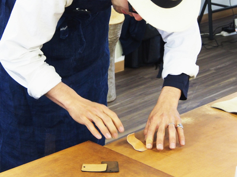
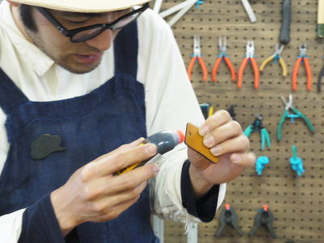

 

## (7)レザー（本革）の仕上げ技法
  

FabLab SENDAI – FLATの『Material Finishing Workshop』というワークショッププログラムでは、レーザーカッターや3Dプリンタを使って作られた造形物の“仕上げ方法”を学びます。プログラム第1回では、 神奈川県鎌倉を中心に世界で幅広く活動をしていらっしゃるKULUSKAのお二人をお招きし、レザークラフトの仕上げ技法についてレクチャーをしていただきました。 
（協力：[KULUSKA](http://kuluska-japan.com/)）

---

 
 

<h3><strong>1. 硬めのレザーを柔らかくする方法</strong></h3>

レザーを端から丸め、手のひらを使って台に押し当て、再度開く。それを繰り返すことで、レザーに徐々に柔らかさがでてくる。 

 

 

   

<h3><strong>2. レーザーカット時のコバ（断面）の焦げ処理方法</strong></h3>

初めに、焦げをウェットティッシュで拭く。その際に、水分が銀面（表面）やトコ（裏面）に付着した場合は、最後にその面も全てウェットティッシュで拭くと良い。 

 

 

<strong>焦げをしっかり落としたい場合</strong>  
焦げを完全に落として本来のコバの色に戻したい場合は、400番〜1000番のやすりをかける。穴の中の焦げを落としたい場合は、ダイヤモンドやすり等棒状のやすりを使用する。 

 

 

 

<strong>柔らかいレザーをやする場合</strong>  
柔らかいレザーはそのままの状態ではなく、くるくる丸めるとやすりがけがしやすくなる 

 

 

<strong>重ねて接着したレザーにやすりがけをする場合</strong>  
何枚か重ねて貼り合わせたレザーにやすりをかけると、それぞれのコバが馴染み、まるで1枚のレザーかのように見せることができる。 

 

   

<h3><strong>3. コバ（断面）を滑らかにする方法</strong></h3>

市販されている『トコノール』等の仕上げ剤を布に適量付けてこすると、コバの毛羽立ちがおさまり、滑らかな仕上がりになる。 

 

 

 

<strong>天然素材で仕上げたい場合</strong> 
『フノリ』という海藻でも、コバを滑らかにすることができる。少量の水で『フノリ』を煮込むと透明な糊状になり、それをトコノールと同じように布につけてこすることで、コバがとても滑らかになる。 

 

 

<strong>更に滑らかにしたい場合</strong> 
布ではなく『ヘチマ』を使うと、コバの仕上がりが更に滑らかになり、艶も増していく 

 

 

   

<h3><strong>4. トコ（裏面）を滑らかにする方法</strong></h3>

コバ処理同様、市販されている『トコノール』等の仕上げ剤、『フノリ』から作った糊をたっぷりとトコ面に塗り、布やヘチマでこすると滑らかになる。このとき、レザーを保湿する気持ちで、仕上げ剤や糊をたっぷり塗ることが綺麗に仕上がる秘訣。 

 

 

<strong>更に滑らかにしたい場合</strong> 
布やヘチマではなく、角が丸く加工されたガラス板で強く力をかけながらこすると、より滑らかに仕上がる。熱で２つ折りにしたアクリル板の、折り曲げ部分でも代用可能。 

 

 

<h3><strong>5. コバ（断面）に色を付ける方法</strong></h3>

今回は、『コバコート』（水性着色仕上剤）や『ローパスバチック』（皮革染料）を使用する。 

 

 

<strong>それぞれの剤の仕上がりの違い</strong> 
写真上が『コバコート』（水性着色仕上剤）、下が『ローパスバチック』（皮革染料）を使用したもの。『コバコート』は素材の上にインクが乗るようなツヤのある仕上がりに、『ローパスバチック』は素材にインクが染み込んだようなマットな仕上がりになる。 

 

 

<strong>『コバコート』の塗布方法</strong> 
『コバコート』は液体のりのように先端にスポンジが付いているため、キャップを外したらそのままコバに着色剤を塗ることができる。 

 

 

<strong>『ローパスバチック』の塗布方法</strong> 
『ローパスバチック』の中身を小皿に分け、クリップを持ち手代わりにした硬めのスポンジで塗っていく。油性ペンなどでも代用可能。 

 

   

（Last Updated: 2022.10.31）

