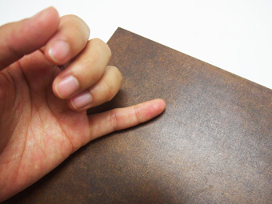

 

## MDFの拭き漆仕上げ
  

[MDF](02-1-mdf.md)という木質ボードに、拭き漆（ふきうるし）という技法を施すと、普通のMDFとは一味違う印象の素材になります。（拭き漆とは、木地に透けた漆を塗っては布で拭き取るという作業を繰り返す技法で、木目が生かされた仕上がりとなるのが特徴です。） 

---

**注意**
* 本漆には肌がかぶれる成分が含まれており、漆アレルギーをお持ちの方は稀に症状が見られる場合があります。予めご了承ください。
* 漆は、酵素の働きによって硬化するため、 酵素の働く温度（25度前後）と湿度（80%以上）が必要です。そのため、上記環境を保つための室（ムロ／段ボールや収納ケース等）を使用しなければいけません。
* 漆は衣服に付着すると落ちません。汚れても良い服装で実施してください。
* 腕周りは、なるべく肌は出さないようにしましょう。（エプロン、アームカバーがあると便利です。）
* 髪の長い方は必ずまとめ、爪の長い方はなるべく切っておいてください。（手袋を破ってしまう可能性があります。）
* 漆の匂いが気になる方やかぶれが不安な方はマスクを着用してください。
* 漆は硬化に時間を要するため、作業後3週間程度経ってから使用可能となります。

---

 
 

<h3><strong> 0. 材料・道具 </strong></h3>

 

* 生漆（200gで、300 x 600mmのMDFを10枚程度塗ることが可能）
* MDF
* ケーク紙（漆塗り用）
* テレピン油（漆の希釈や、ガラス板、ヘラの洗浄に使用）
* なたね油（刷毛洗浄や、肌に漆がついたときの拭き取りに使用）
* ウエスもしくはキッチンペーパー（ガラス板の掃除用）
* ゴム手袋もしくはビニール手袋
* やすり（#400）
* ガラス板（※ガラス製の製の器やボウル等でも代用可）
* 板材（ガラス板と同じサイズで厚さ10mm程度のもの。ガラス板を使用しない場合は不要）
* プラスチック製ヘラ（※ガラス製の器等で漆を混ぜる場合はプラスチックスプーンでも代用可）
* 養生シート（テーブルや椅子を養生できるもの）
* 保管ケース（ダンボールや収納ケースで可）
* 新聞紙（保管ケース内の湿度を保つために使用）
* ぞうきん（保管ケース内に水を塗布するのに使用）
* 割り箸（拭き漆仕上げをした木材などをケースで硬化させる際に使用）

---

**事前準備** 
* ケーク紙を幅15cm程度にカットする。
* 拭き漆MDFを入れておくための段ボールや収納ケース等に、新聞紙を敷いて、雑巾などを使って全体を湿らせておく。
* 上記ケース内に割り箸等、拭き漆MDFを置いておくための支えをセットする。
* 作業を行なうテーブルに養生シートやビニールなどを敷き、エプロンと手袋を装着する。（かぶれが心配な場合は、ハンドクリームやオイルなどを手に塗っておく。）

---

 

<h3><strong>1. MDFのやすりがけ</strong></h3>

ゴム手袋をし、#400のやすりでMDFの表面に細かい傷をつけていく。（MDFは、表面が糊でコーティングされたようになっているので、そのままだとあまり漆が染み込まない。そのため、その糊を剥がすためにやすりがけを行う必要がある。） 
やすりがけが終わったら、MDFの表面に付いた粉塵を手のひらや布等で拭き取る。 

<iframe width="560" height="315" src="https://www.youtube.com/embed/F6EhHFjScXw" title="YouTube video player" frameborder="0" allow="accelerometer; autoplay; clipboard-write; encrypted-media; gyroscope; picture-in-picture" allowfullscreen></iframe>

  

<h3><strong>2. 漆とテレピン油の混合(1)</strong></h3>

生漆：テレピン油＝3:1程度で混ぜ合わせる。生漆は、チューブのキャップを開けるとすぐに出てくるので、飛散しないように注意すること。 

<iframe width="560" height="315" src="https://www.youtube.com/embed/sYcWJec2qwk" title="YouTube video player" frameborder="0" allow="accelerometer; autoplay; clipboard-write; encrypted-media; gyroscope; picture-in-picture" allowfullscreen></iframe>

  

<h3><strong>3. 生漆とテレピン油の混合(2)</strong></h3>

ヘラを使って、生漆とテレピン油を混ぜ合わせる。空気を含ませるようにかき混ぜるのではなく、2つの液を馴染ませるように摺り合わせながら混合する。 
このとき、ヘラを大きく動かすと漆が飛んで服などに付着する可能性があるため、慎重に作業を進めること。 

<iframe width="560" height="315" src="https://www.youtube.com/embed/AvhqG4MKypM" title="YouTube video player" frameborder="0" allow="accelerometer; autoplay; clipboard-write; encrypted-media; gyroscope; picture-in-picture" allowfullscreen></iframe>

  

<h3><strong>4. ケーク紙の準備</strong></h3>

漆を塗るのに使用するケーク紙は、およそ30 x 40mm程度になるように折り曲げて使用する。材料に当たる面に、ケーク氏の折り目や端がこないようにすると尚良い。 

<iframe width="560" height="315" src="https://www.youtube.com/embed/AVLLlDqVLb4" title="YouTube video player" frameborder="0" allow="accelerometer; autoplay; clipboard-write; encrypted-media; gyroscope; picture-in-picture" allowfullscreen></iframe>

  

<h3><strong>5. 漆の摺り込み</strong></h3>

ケーク紙に漆を付け、MDFに摺り込んでいく。表面だけではなく、端面にもしっかり染み込ませる。 
はじめのうちは漆の吸い込みが早いため、全体的にツヤが出るまで何度も重ね塗りする。 

<iframe width="560" height="315" src="https://www.youtube.com/embed/xVNB9ZcGp08" title="YouTube video player" frameborder="0" allow="accelerometer; autoplay; clipboard-write; encrypted-media; gyroscope; picture-in-picture" allowfullscreen></iframe>

  

<h3><strong>6. 漆の拭き取り</strong></h3>

MDFの表面に漆が残るようになってきたら、綺麗なケーク紙で拭き取る。 
片手でケーク紙をはさんでMDFを持ち、もう片方の手でケーク紙を使ってMDF表面の漆を拭き取る。ゴム手袋で直接MDFをつかんでしまうと、仕上がったときに色ムラが発生するため、必ずケーク紙を使って持つこと。 
拭き取りが完了したら、水で湿らせておいた収納ケース等にMDFを入れておきます。 

<iframe width="560" height="315" src="https://www.youtube.com/embed/fJ7dORDQYzk" title="YouTube video player" frameborder="0" allow="accelerometer; autoplay; clipboard-write; encrypted-media; gyroscope; picture-in-picture" allowfullscreen></iframe>

  

<h3><strong>7. 作業板の掃除</strong></h3>

作業が終了したら、作業板全体にテレピン油をかけ、付着した漆を拭き取る。 

<iframe width="560" height="315" src="https://www.youtube.com/embed/GSj78lr1kn4" title="YouTube video player" frameborder="0" allow="accelerometer; autoplay; clipboard-write; encrypted-media; gyroscope; picture-in-picture" allowfullscreen></iframe>

  

<h3><strong>8. ケーク紙の処理</strong></h3>

テレピン油と漆が反応して熱が発生する可能性があるため、拭き漆MDF制作に使用したケーク紙は丸めて捨てるのではなく、1日程度広げて軽く硬化させてから処分する。 

<iframe width="560" height="315" src="https://www.youtube.com/embed/CjR0mSPAmz0" title="YouTube video player" frameborder="0" allow="accelerometer; autoplay; clipboard-write; encrypted-media; gyroscope; picture-in-picture" allowfullscreen></iframe>

  

<h3><strong>8. 硬化の確認</strong></h3>

拭き漆MDFは、2,3日である程度まで硬化するが、素手で触れての硬化の確認は、拭き漆作業から1週間程度時間をとってから行う。 
右図のように、小指の背面で、MDFの表面を軽く撫でて硬化の状況を確認する。

 

**★全体的にサラッとした感触＆表面にわずかなザラつきを感じる場合**  
うまく硬化が進んでいる。2,3日に1回程度、収納ケース内に雑巾等で水分を与えながら更に硬化を進める。 

**★しっとりとした感覚が少しでもある場合** 
硬化の進みがやや遅い。1日に1回程度、収納ケース内に雑巾等で水分を与え、気温も保てるよう調整し、2,3日後に再び上記方法で硬化の状況を確認する。 

  

<h3><strong>9. 硬化後のやすりがけ</strong></h3>

* 3週間程度経ったら素材として使用して問題ない。（しっとりした感覚がある場合は、使用せずに引き続き硬化させること。） 
* 漆を塗っただけのMDFは、表面を手で触ったときに少しザラつきがあるため、#800以上のやすりで撫でるようにキメを整える。（力を入れると漆ごと剥がれる可能性があるため、触れるか触れないかくらいの優しい力で行う。） 
* より艶を出したい場合は、テレピン油は使用せずに再度同じ手順で拭き漆作業を行う。重ね塗りする場合は、1回目と2回目の間は2,3日程度空いていれば問題ない。最終硬化のみ3週間程度時間を使う。 
  

---

**漆が肌に付着した場合** 
作業中にビニール手袋が破れているなどして漆が直接地肌に付着した場合は、キッチンペーパーなどに油（なたね油など）を染み込ませたもので拭き取る。漆の成分は落ちても、特に爪や皮膚のシワなどに色素や顔料が残ってしまう場合もあるが、油でも落ちなくなってきたらハンドソープなどで手を洗い、よく保湿すること。 

   

（Last Updated: 2022.10.31）

