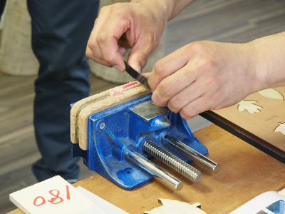
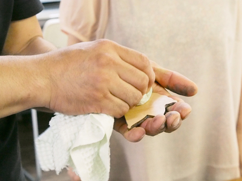
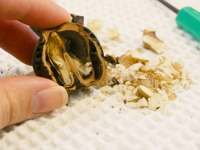

 

## 木材の仕上げ技法
  

FabLab SENDAI – FLATの『Material Finishing Workshop』というワークショッププログラムでは、レーザーカッターや3Dプリンタを使って作られた造形物の“仕上げ方法”を学びます。プログラム第2回では、 宮城県石巻市に工房を構え、無垢の木を使った家具や作品を製作されている木のしごと 樹々 齋藤英樹さんをお招きし、木材の仕上げ技法についてレクチャーをしていただきました。 
（協力：[木のしごと樹々](http://juju2005.com/)）

---

 
 

<h3><strong>1. 表面をやすりがけする方法</strong></h3>

レーザーカッターによる焦げは、まずウェットティッシュ等で拭く。ただし、ウェットティッシュにはアルコール分が含まれているタイプが多いため、表面に水分を吸い込ませすぎないよう注意する。（アルコールは溶剤と一緒）
 

 

 

まずは180番のヤスリで、表面全体に木目に沿って傷をつけるようやすりがけする。細かな傷が消えたら濡れタオルで軽く拭く。表面が毛羽立っていたらそのまま乾くのを待ち、次の番数のヤスリでやすりがけする。（180番→240番→360番の順で行う） 

 

 
<li>木材の湿り気が取れてからやすりがけしないと、木粉によってヤスリが目詰まりを起こすので注意。
<li>ヤスリをかける際、慣れるまでは一方向にだけ動かすと良い。（手前から奥に向かって、力を入れて動かすなど）
<li>木材に限らず、広く平らな面をヤスリがけする場合は、ヤスリと素材が平らに接するよう当て木などを使用すると良い。（紙ヤスリを手で持った状態で動かすと、指の凹凸に合わせて素材がやすられてしまうため平らに加工することができないため。）
<li>木目の方向が分かりにくい木材を使用する場合は、綺麗に見えるようやすりで傷をつけると良い。
<li>後にオイルフィニッシングをする場合、表面をつるつるにするのではなく、表面に均一に傷をつけることを目標にすると良い。

   

<h3><strong>2. レーザーカット時の断面の焦げ処理方法</strong></h3>

素材をクランプで固定し、カッターの刃を素材に対して垂直に立て、手前から奥へ動かしながら素材を削る。その際に、刃の中心を両親指で押し出すようにたわませ、刃全体を少し手前に倒すようにすると、カンナ掛けのようにスルスルと素材を削ることができる。（柔らかい刃よりも、バネのようにしなる刃のほうが扱いやすい。） 

 

   

<h3><strong>3. オイルを使った仕上げ方法</strong></h3>

<strong>『オスモノーマルクリア（オスモカラー）』を使用する場合</strong> 

適当な布に『オスモノーマルクリア』を染み込ませ、素材にすり込む。尚『オスモノーマルクリア』が染み込んだ布をそのまま捨てると自然発火の恐れがあるため、必ず水に浸してから廃棄すること。（詳しくは商品説明書を参照。） 

 

 

 

<strong>クルミでオイルフィニッシングする場合</strong> 
まずはクルミの殻をハンマー等で割って中の実を取り出す。 

 

 

取り出した実は適当な布で包み、てるてる坊主を作る要領で、輪ゴムでしっかり留める。
 

 

かなづちで軽く叩き、布に油を染み込ませる。このとき、土台に木材を使用すると、そこに油分が染み込む可能性があるため注意すること。 
布全体に油分が充分行き渡ったら、木地の表面にすり込む。 
もしクルミ以外で同様の仕上げを行いたい場合は、クリ、エゴマ、ヒマワリなどを使用すると良い。
 

 

   

（Last Updated: 2022.10.31）

