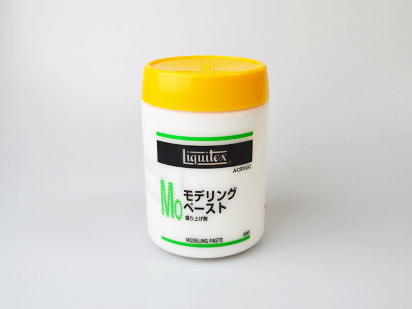
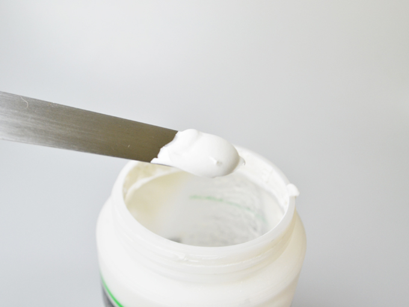
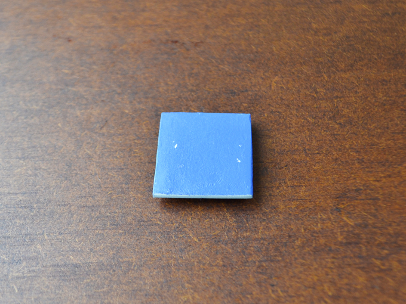
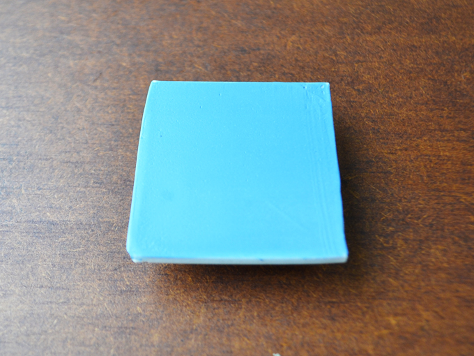

 

## PLAの仕上げ技法（モデリングペースト）
  

安価で手軽なFDM（熱溶解積層）方式の3Dプリンタでは、PLA（ポリ乳酸）という材料がよく使用されています。3Dプリントした造形物の表面は、樹脂の積層跡による縞模様があるため、塗装をする場合にはやすりがけをしない限り凹凸が目立ってしまいます。しかしながら、PLAはやすりがけの難しい材料であることから、ここではパテ埋めをするように凹凸を隠す方法をご紹介します。 
（※水分や衝撃で剥離する可能性があるため、必ずご自身で試作を行ってください。）

---

 
 

<h3><strong>材料</strong></h3>

<a href="https://www.jp.liquitex.com/products/professional/gessoes-mediums-varnishes/%e3%83%a2%e3%83%87%e3%83%aa%e3%83%b3%e3%82%b0%e3%83%9a%e3%83%bc%e3%82%b9%e3%83%88/">Liquitex社のモデリングペースト</a>を使用。 
モデリングペーストは“大理石の粉末とアクリルエマルジョンからできた、粘りの強いパテ状の白色下地剤”で、アクリル絵の具などと混ぜて使用することで、絵画作品に立体感を持たせることができる。
 

 

 

   

<h3><strong>例1. モデリングペースト＋スプレー塗装</strong></h3>

<strong>作業順序</strong>

(1) モデリングペーストを1mm程度塗布  
(2) 400番のやすりでやすりがけ  
(3) モデリングペーストを1mm程度塗布  
(4) 400番のやすりでやすりがけ  
(5) 水性スプレーで色付け 

 

モデリングペーストは厚塗りすると表面にヒビが入る可能性があるため、なるべく薄く塗り重ねる必要がある。また、硬化すれば簡単にやすりがけで形を整えられるため、モデリングペーストの塗布時には、表面を綺麗に仕上げることよりも積層の段差を埋めることに専念したほうが良い。

   

<h3><strong>例2. モデリングペースト＆アクリル絵の具 + ラッカー（マット）</strong></h3>

<strong>作業順序</strong>

(1) モデリングペーストとアクリル絵の具を6:1の割合で混合 
(2) (1)で作った液を1mm程度塗布 
(3) 400番のやすりでやすりがけ 
(4) (1)で作った液を1mm程度塗布 
(5) 400番のやすりでやすりがけ 
(6) ラッカー（マット）吹き付け ×2回 

 

モデリングペーストは単体では乾燥が早いため、あらかじめ塗装に使用したい色のアクリル絵の具を混ぜておくと良い。こうすることで伸びがよくなり、乾燥のスピードもやや遅くなる。（水を混ぜてモデリングペーストを薄めることもできるが、そうすると造形物の段差を埋めにくくなる。） 
また、モデリングペーストを塗った後にラッカーを吹き付けることで、爪で引っ掻いた程度では剥がれないほどの強度が出る。（グロスタイプのラッカーも使用可能。）

   

（Last Updated: 2022.10.31）

