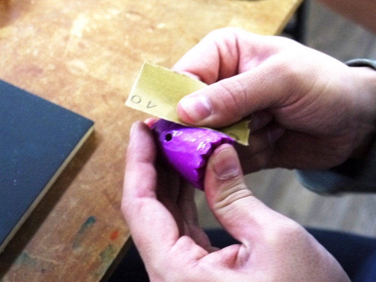

 

## PLAの仕上げ技法（アルテコ モデリングコート）
  

安価で手軽なFDM（熱溶解積層）方式の3Dプリンタでは、PLA（ポリ乳酸）という材料がよく使用されています。3Dプリントした造形物の表面は、樹脂の積層跡による縞模様があるため、塗装をする場合にはやすりがけをしない限り凹凸が目立ってしまいます。しかしながら、PLAはやすりがけの難しい材料であることから、ここでは表面を滑らかにする溶剤を使用した仕上げ方法をご紹介します。 

---

 
 

<h3><strong>材料</strong></h3>

<a href="https://www.alteco.co.jp/cms/wp-content/uploads/catalog/modelling_coat.pdf">ALTECO モデリングコート C2</a>と<a href="https://www.alteco.co.jp/products/">アルテコ 瞬間接着剤用 硬化促進剤 スプレープライマー</a>を使用。 
モデリングコートで造形物の段差を埋め、スプレープライマーでコートの硬化を早める。
 

 

 

ここでは右のような3Dプリント造形物を使用。表面にはっきりと段差が見られる。
 

 

   

<h3><strong>1. モデリングコートを造形物に塗布</strong></h3>

モデリングコートを造形物の全体に塗布し、スプレープライマーを吹きかける。このとき、一度に広い面積をコーティングしようとするのではなく、少しずつ塗り重ねると良い。 
（筆でモデリングコートを塗布すると、すぐに筆が硬化してしまったため、今回はボトルから直接塗布した。） 

 

左：塗布作業を3回ほど行ったもの 
右：元の造形物

 

 

部分的に液だまりが発生する場合がある。
 

 

   

<h3><strong>2. 表面をやすりがけ</strong></h3>

モデリングコートが硬化したら、全体にやすりがけをする。徐々に目を細かいやすりを使用しながら、ツヤ箇所がなくなるまでやすりがけを行なう。最終的にはプラスチック用のコンパウンド剤（磨き剤）等で、ツヤ出しを行なう。 

 

 

   

<h3><strong>3. 表面をコーティング</strong></h3>

プラスチック用のコンパウンド剤ではなく、クリアスプレーをで仕上げることもできる。 
 

左：元の造形物 
中：モデリングコート塗布→400番のやすりをかけた造形物 
右：モデリングコート塗布→400番のやすりがけ→クリアグロススプレーをかけた造形物 

 

   

（Last Updated: 2022.10.31）

