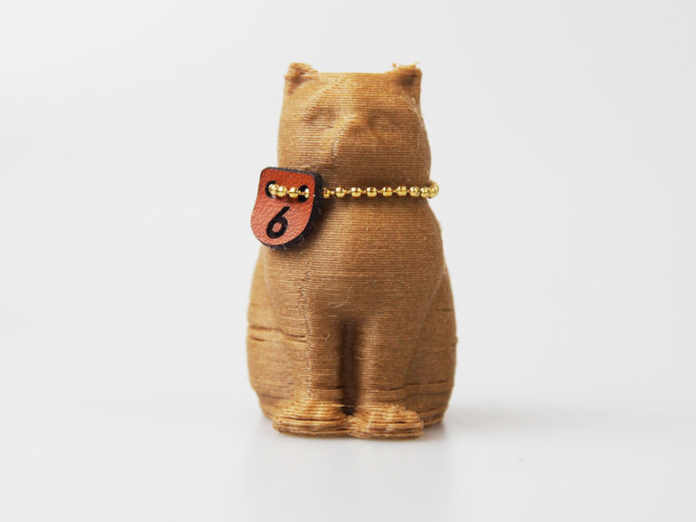

 

## (7) 竹フィラメント
  

使用機種：Makerbot Replicator2（ヒートベッドなし） 
材料：colorFabb BAMBOOFILL 
プリント温度：200℃ 
Layer Height（積層ピッチ）：0.3mm 
Infill：5% 
Number of Shells：2 
 
竹の繊維が入ったフィラメントで、仕上がりも独特のやわらかな風合いになる。竹の繊維が大きいためか、他のフィラメントよりも詰まりやすい印象。

   

（Last Updated: 2016.04.24）

