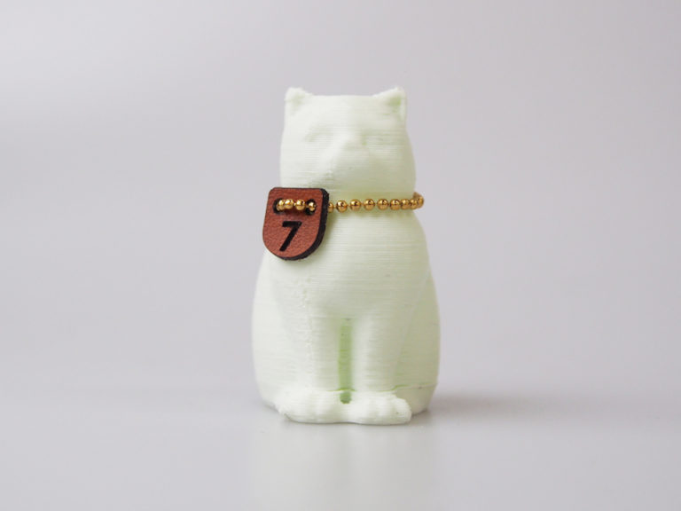

 

## #08 ガラス強化フィラメント
  

使用機種：Makerbot Replicator2（ヒートベッドなし） 
材料：3D-Fuel Glass Filled PLA 
プリント温度：200℃ 
Layer Height（積層ピッチ）：0.3mm 
Infill：5% 
Number of Shells：2 
 
ガラス素材を配合することで、より強度を上げたPLA。一般的なPLAフィラメントよりも、1.4倍強い引張強度、1.3倍の衝撃靱性、1.9倍の柔軟性（PLAよりも3.4％の伸び率）を実現しているとのこと。仕上がりはややマットな印象。

   

（Last Updated: 2016.04.24）

