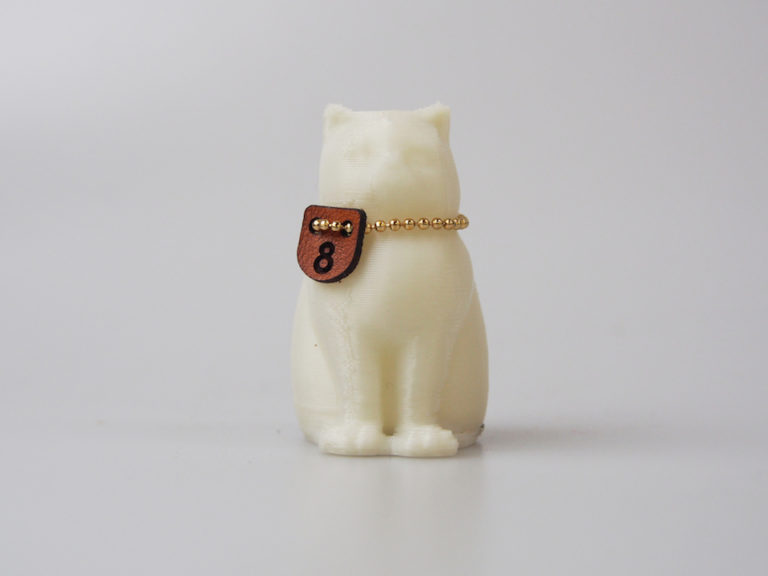
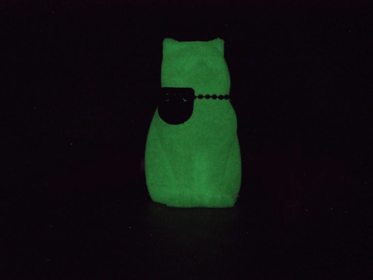

 

## (9) 蓄光フィラメント
  

使用機種：Makerbot Replicator2（ヒートベッドなし） 
材料：[colorFabb GLOWFILL](https://colorfabb.com/glowfill) 
プリント温度：210℃ 
Layer Height（積層ピッチ）：0.3mm 
Infill：5% 
Number of Shells：2 
 
一見ただの白いPLAに見えるが、光に当てた後に

   

（Last Updated: 2016.04.24）

