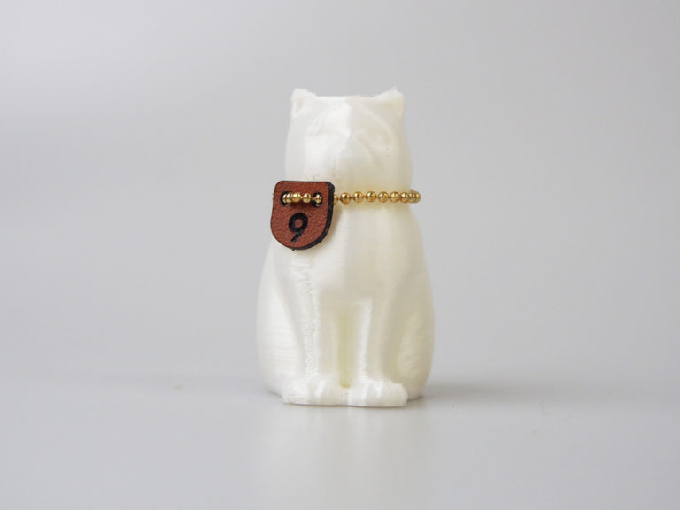

 

## (10) 分解性フィラメント
  

使用機種：Makerbot Replicator2（ヒートベッドなし） 
材料：3D Fuel Biome3D Natural 
プリント温度：200℃ 
Layer Height（積層ピッチ）：0.3mm 
Infill：5% 
Number of Shells：2 
 
土に埋めれば100%分解される地球にやさしいフィラメント。シルクのような仕上がりで、光を綺麗に反射する。

   

（Last Updated: 2016.04.24）

