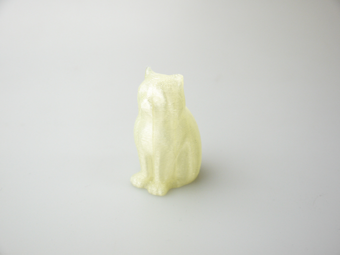

 

## #11 ルミシスフィラメント
  

使用機種：Makerbot Replicator2（ヒートベッドなし） 
材料：[Lumisis Filament®（PLA）](https://central-techno.co.jp/filament.html) 
プリント温度：210℃ 
Layer Height（積層ピッチ）：0.3mm 
Infill：5% 
Number of Shells：2 
 
ブラックライトで発光するフィラメント。

   

（Last Updated: 2017.07.08）

