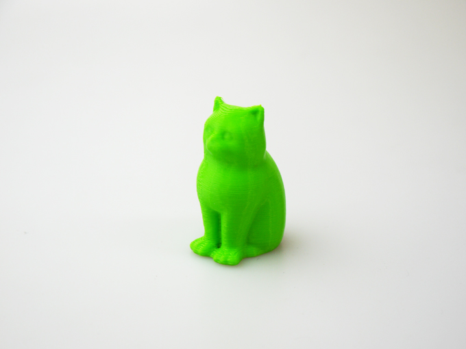

 

## #12 高性能コポリエステルフィラメント
  

使用機種：Makerbot Replicator2（ヒートベッドなし） 
材料：colorFabb nGen 
プリント温度：210℃ 
Layer Height（積層ピッチ）：0.3mm 
Infill：5% 
Number of Shells：2 
 
ColorFabb社とEastman Chemical社によって食品用容器のために開発された“コポリエステル”による次世代高性能フィラメント。米国食品医薬品局（FDA）の規制に準拠した素材となっている。

   

（Last Updated: 2017.07.08）

