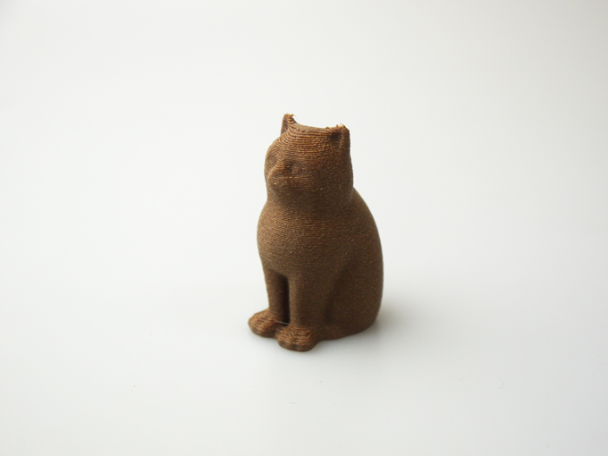

 

## #13 コルク原料フィラメント
  

使用機種：Makerbot Replicator2（ヒートベッドなし） 
材料：[colorFabb CORKFILL](https://colorfabb.com/corkfill) 
プリント温度：210℃ 
Layer Height（積層ピッチ）：0.3mm 
Infill：5% 
Number of Shells：2 
 
PLAにリサイクルコルク原料が含まれているため、ダークブラウンのマットな質感が特徴。少しひっかくとすぐに表面に白っぽい跡が付く。

   

（Last Updated: 2017.07.08）

