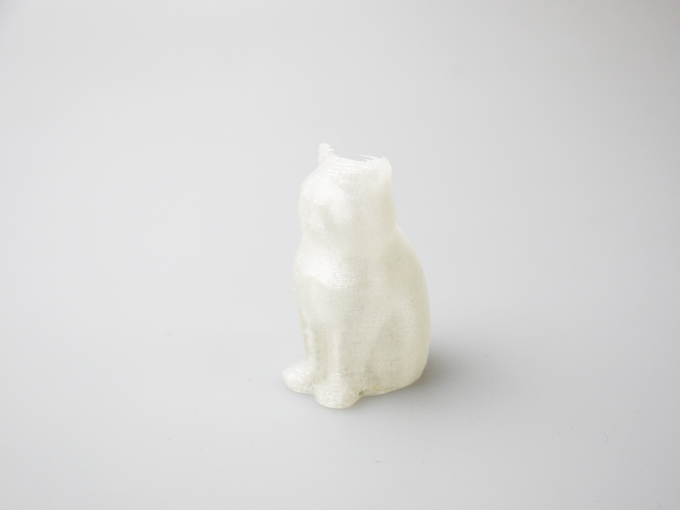
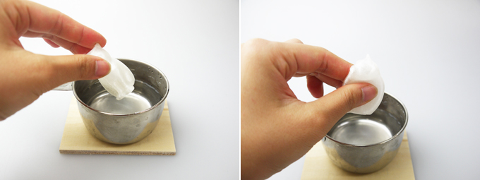
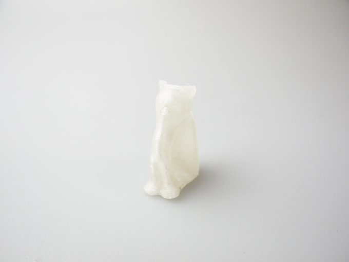

 

## (14) 形状記憶ポリマーフィラメント
  

使用機種：Makerbot Replicator2（ヒートベッドなし） 
材料：[SMPフィラメント](https://www.krk.co.jp/filament/product/smp.html) 
プリント温度：210℃ 
Layer Height（積層ピッチ）：0.3mm 
Infill：5% 
Number of Shells：2 
 

このフィラメントで作った造形物は、常温では固体だが、お湯などで55℃以上に温めることで柔らかくなり、造形物の形状を変更できる。更に、一度形状を変更した造形物は、以下の動画のように再び55℃以上に温めることで造形時の形状に復元することも可能。

 

<iframe width="560" height="315" src="https://www.youtube.com/embed/l8bdHuj8OMw" title="YouTube video player" frameborder="0" allow="accelerometer; autoplay; clipboard-write; encrypted-media; gyroscope; picture-in-picture" allowfullscreen></iframe>

   

（Last Updated: 2017.07.08）

