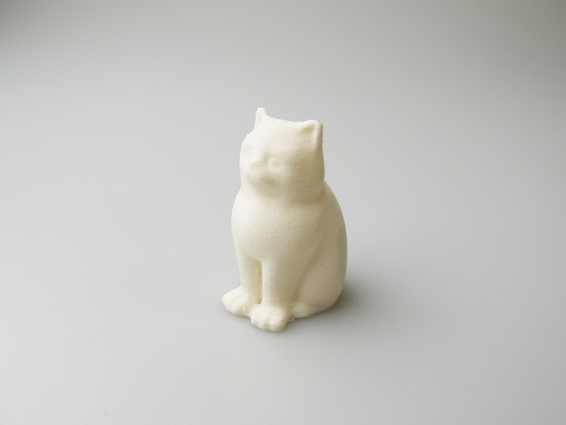
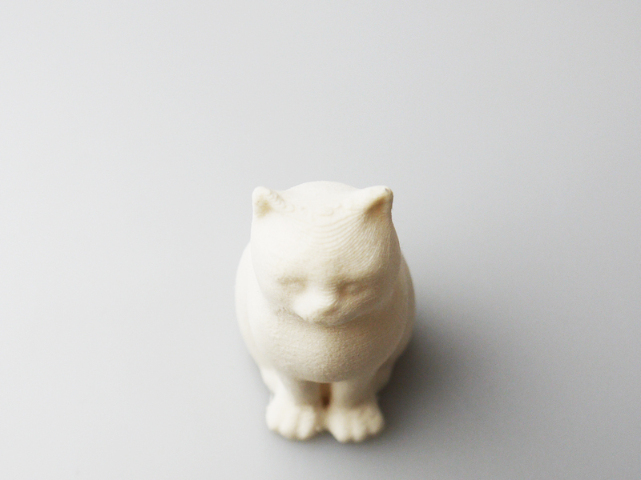

 

## #16 高品質PLAフィラメント
  

使用機種：Makerbot Replicator2（ヒートベッドなし） 
材料：[Protopasta Matte Fiber HTPLA](https://www.proto-pasta.com/products/matte-fiber-htpla-white) 
プリント温度：230℃ 
Layer Height（積層ピッチ）：0.2mm 
Infill：5% 
Number of Shells：2 
 

非常にマットな仕上がり。細かい部分では積層の跡が見えやすいものの、普通のPLAのように光に反射しないため凹凸が目立ちにくい。更に、非常に研磨がしやすい材質のため、#240程度のやすりを軽くかけるだけで積層跡が目立たなくなる。植物性の繊維が含まれており、普通のPLAと比べるとプリント後の縮みが少ない。
   

（Last Updated: 2018.02.09）

